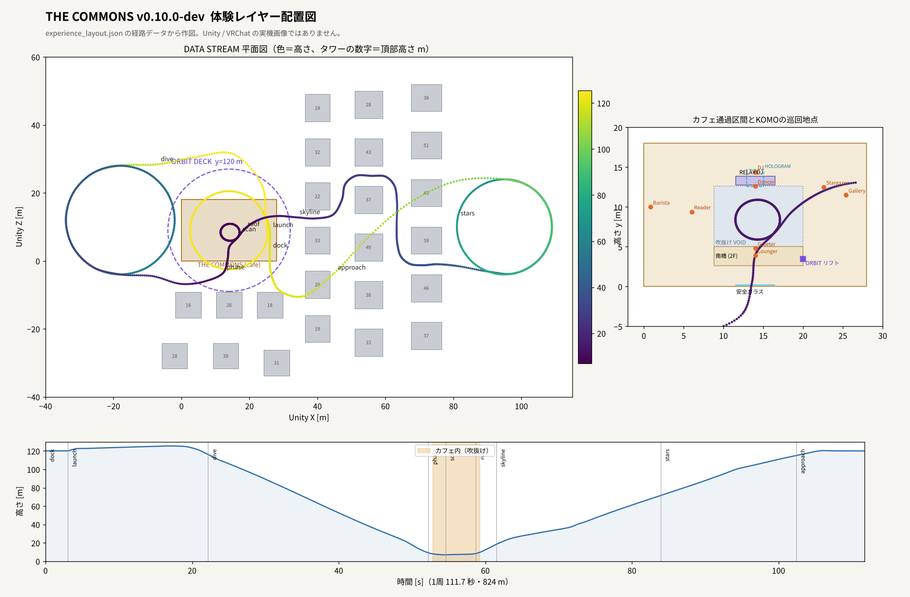

# v0.10.0（開発版）— 体験レイヤー：視界ジャック・ORBIT DECK・DATA STREAM・KOMO・アダプティブ音楽

**未リリースの開発ブランチです。** Unity/UdonSharp/シェーダーのコンパイル、ライトベイク、VRChat Build & Test、Quest実機は未検証です。リリース画像（AGENTS.mdの要件）はリリース時に実モデルから撮影します。

基準はv0.9.0（`c3a50c9`）。**Blenderモデル・tcmesh・既存のメッシュ記録・カートの走路は変更していません。** 追加物はすべて `CommonsExperienceBuilder` がシーン生成時にプリミティブと手続きメッシュから作ります。ラップタイム計測はCVS2側で行う前提のため、カートには手を入れていません。

「メタバースだからこそできる体験」を軸に、次の5つを追加しました。

| 追加 | ひとことで |
| --- | --- |
| ORBIT DECK | カフェの120 m上空に浮かぶデッキ。低重力の井戸でふわっと跳び、ジャンプ長押しで浮上 |
| DATA STREAM | デッキ発のライド。街を降下し、**カフェのガラスと屋根をすり抜けて吹抜けを1周**し、タワーの間を抜けて戻る |
| SIZE LAB | 自分の大きさを×0.1／×0.5／×1／×4に変える |
| 視界ジャック | 頭の周りに張る演出レイヤー。ワープ、すり抜けグリッチ、データの雨、星空など10種類。設定で強さ・種類を選べる |
| KOMO | 浮遊するオリジナルのコンパニオンロボ。毎日のスケジュールで店内を巡り、ライドにも乗る |
| アダプティブ音楽 | 7本のオリジナル音源を、モード・照明・時刻・場所・ライドに応じて重ねる |

## 1. 入口

| 項目 | Unity位置 m | 内容 |
| --- | --- | --- |
| ORBITリフト | (20, 1.3, 3.45) | KARTポータルの右。紫のフレーム、床パッド、出発案内。Interactでデッキの到着点 (14, 120.1, -3) へ |
| EXPERIENCEパネル | (19.95, 1.92, 1.40) | 南壁側。視界ジャック・音楽・KOMOのローカル設定（同じパネルをデッキにも設置） |
| 既存ポータル | — | 上下階・FPV・KART・各帰路もワープ演出付きに。WARP OFFで従来どおり即時移動 |

## 2. ORBIT DECK（上空デッキ）

| 項目 | 仕様 |
| --- | --- |
| 位置・大きさ | 中心 (14, 120, 9)、床半径18 m。街のタワー（最高約58 m）より上 |
| 囲い | 高さ1.1 mのガラス手すり＋高さ7 mのホログラムの力場（見た目）。当たり判定は半径18.6 mの壁40枚と高さ28 mの天井で、落下・飛び出しを防止 |
| 重力井戸 | 中央の半径7 m。重力0.16倍、ジャンプ3.2。**空中でジャンプを押し続けると最大2.6 m/sで上昇**。頭上に回るホロ惑星を目指して浮かべる |
| 救助 | デッキにいた直後に8 m以上落下したら到着点へ戻す（ライド中は対象外） |
| 設備 | RETURN TO CAFE（カフェの (20, 0.12, 2) へ）、SIZE LAB、EXPERIENCEパネル、DATA STREAMの乗り場と発車案内 |
| 視界 | デッキにいる間は視界の周縁に星（ORBIT STARS、ライド・アトラクション分類） |

## 3. DATA STREAM（ライド）

**同期変数なし。** すべての参加者がサーバー時計と同じ焼き込み表（ビルダーが生成）から車両位置を計算するため、途中参加でも全員に同じ位置で見えます。座った参加者は各クライアントで同じステーションに追従します。

| 項目 | 値 |
| --- | --- |
| 車両 | 2両×4席（2列×2）。各車の先頭はKOMOの席 |
| 1周 | 824 m、約111.7秒。制御点115、1区間16サンプル、中心経路は向心Catmull-Rom |
| 周期 | 乗車30秒＋走行111.7秒＋降車4秒＝約145.7秒。2両は半周期ずらして運行し、乗り場で重ならない |
| 経路 | デッキ上の周回 → 西側の降下ヘリックス（2.5周、111→25 m）→ 南のタワーとカフェの間 → **南面ガラスをすり抜けて吹抜けへ**（南橋の上、DJブースとホログラムの手前を1周）→ **屋根をすり抜けて上空へ** → タワー列の間をスラローム → 東側の上昇ヘリックス（1.56周、43→100 m）→ 街を見下ろしながらデッキへ |
| 検査値 | タワー・基壇との最小離隔2.19 m（車体半幅0.95 m）、吹抜け内の経路が床・DJブース・ホログラムに干渉しない、最大横加速度14.8 m/s²、勾配+35.7°／-30.7°、デッキ上の通行者の頭上2.49 m以上（柵で囲った乗り場レーンを除く） |
| 乗降 | 乗車時間中に座席をInteract。**いつでも降りられ**、走行中に降りるとワープ演出の後に乗り場へ戻る。到着時は自動で降車し乗り場へ |
| 酔い対策 | REDUCED MOTION（既定ON）では**自分の乗る車両だけ水平を保つ**（ピッチ・ロールなし、他の人からは傾いて見える）。速度と旋回に応じたトンネルビネット（RIDE VIGNETTE、既定ON） |
| 音 | 車両ごとの3D走行音（ドップラー付き）。乗車中はライド用の音楽ミックス |

演出キュー（視界ジャック、ライド・アトラクション分類）:

| 区間 | 演出 |
| --- | --- |
| 発車 | WARP 1.6秒＋whoosh |
| 降下ヘリックス | DATA RAIN 9秒 |
| ガラス・屋根・力場を通過 | GLITCH 0.9秒＋グリッチ音（境界を越えた瞬間に自動） |
| 吹抜け | HOLO SCAN 8秒 |
| 街の上 | WARM DREAM 5秒 |
| 上昇ヘリックス | ORBIT STARS 14秒 |
| 到着前 | HOLO SCAN 3秒＋チャイム |

経路を調整する場合は、生成シーンの `ATTR_DataStream/Path_ControlPoints` を動かして **The Commons → Experience → Rebake Ride** を実行します。恒久的な変更は `Blender/build_experience_layout.py` を編集して再生成します（離隔・干渉の検査が失敗すると書き出しません）。

## 4. 視界ジャック

頭を囲む球に描くローカル演出です。頭の向きで計算するため両眼で一致し、鏡・VRChatカメラ・他の参加者には映りません。何も出ていないときは描画自体を止めます。

| チャンネル | 用途 |
| --- | --- |
| WARP | ポータル・リフト・ライド発車・サイズ変更 |
| GLITCH | ガラス・屋根・力場のすり抜け |
| SCAN | ライドの吹抜け・到着、CYBER照明時の環境演出 |
| STARS | ORBIT DECK、上昇ヘリックス |
| DATA RAIN | 降下ヘリックス |
| FADE | 移動の瞬間の暗転（遷移の頂点でテレポート） |
| TINY | SIZE LABのTINY/SMALL（上下の減光と玉ボケ） |
| DREAM | 街の上、WARM照明時の環境演出 |
| PULSE | DISCO / DJ時の外周の拍動（BEAT PULSE ON時のみ） |
| COMFORT | ライドのトンネルビネット |

| 設定（EXPERIENCEパネル） | 既定 | 内容 |
| --- | --- | --- |
| VIEW FX | SOFT | OFF / SOFT（55%）/ FULL |
| WARP | ON | 移動時の演出。OFFで即時移動 |
| RIDE FX | ON | ライド・デッキ・SIZE LABの演出 |
| AMBIENT FX | OFF | カフェ照明に合わせた常時演出 |
| BEAT PULSE | OFF | DISCO/DJ時の外周の拍動 |
| RIDE VIGNETTE | ON | VIEW FXがOFFでも有効な酔い対策 |

安全面: 点滅・ストロボはありません。模様が切り替わるのは最大毎秒2回、拍動は外周のみで強度0.2以下。LOCAL COMFORTのREDUCED MOTION（既定ON）では模様を静止させ、WARP・GLITCH・DATA RAINを弱めます。

## 5. KOMO（コンパニオン）

**ライセンスについて:** 「Claude」の名称・ロゴ・外観はAnthropicの商標で、公開ワールドでキャラクターとして使う許諾は確認できなかったため使用していません。KOMOはこのワールド用の**オリジナルキャラクター**です（名前・見た目・セリフはビルダー内で変更可能）。白い球体の体、表情の出る顔スクリーン、琥珀色のアンテナ、シアンの軌道リング（「会話が周回する」というワールドのモチーフ）、浮いた両手で構成しています。

位置と行動はサーバー時計から決まるため、全員が同じKOMOを見ます。見つめる相手とセリフは各参加者のローカル（近づくと**その人の画面では自分の方を向く**）。

| 順 | 場所 | 行動 |
| --- | --- | --- |
| 0 | 入口（ポータルの奥） | 到着した人に手を振る |
| 1 | ANCHOR BARの内側 | カップを持ってエスプレッソ |
| 2 | ORBIT CAFE（2F西） | 読書 |
| 3 | RELAY DJブース | ヘッドホンで拍に合わせて揺れる |
| 4 | ステージ | 踊る（DISCO照明・DJモードで本気、それ以外は練習） |
| 5 | OPEN LAB | ポスターを眺めて考え込む |
| 6 | HORIZONテラス | 街を眺めてうとうと |
| 7 | 南橋 | 吹抜けを見下ろして人間観察 |
| ライド | ORBIT DECK | 4周期に1回ワープしてCAR Aの先頭に乗り、高速区間で両手を上げる |

1サイクル約9.7分、各場所約55秒（移動含む）。移動は各場所の出入口点と吹抜けの中心を結んで飛行します。Interactで話しかけると、その時の行動に合ったセリフを英語・日本語で表示（EXPERIENCEパネルのKOMO EN/JPで切替、KOMO QUIETで吹き出しを止める）。近づいた時には時間帯に合わせて挨拶し、初回は話しかけ方を案内します。

**日本語表示の注意:** 吹き出しはUnity標準フォントのTextMeshです。PCでは通常OSのフォントで日本語が表示されますが、Questでは要確認です。表示できない場合はKOMO EN（既定）のまま使用してください。

## 6. アダプティブ音楽

`Blender/build_experience_audio.py` がコードから合成した**オリジナル音源**です（サンプル・他者の録音は不使用）。96 BPM・Dメジャー・16小節（40秒）の継ぎ目のないループを7本、同じ長さで書き出しています。

| ステム | 内容 |
| --- | --- |
| pad | ノコギリ波のデチューンパッド。Dmaj9–Bm9–Gmaj9–A6/9…の16小節進行 |
| keys | FMエレピのシンコペーション伴奏と4小節ごとのフィル |
| bass | サイン系のベース |
| beat soft | ローファイのキック・リム・スイングしたハット、レコードのノイズ |
| beat dance | 4つ打ち、クラップ、オープンハット |
| arp | 16分のアルペジオ（ピンポンディレイ） |
| sparkle | FMベルのきらめき |

| 状況 | ミックス |
| --- | --- |
| カフェ Lounge | pad＋keys＋bass＋beat soft |
| Audience | padと控えめなkeys |
| DJ / Live | bass＋beat dance＋arp＋pad |
| Quiet Night | pad＋keys＋sparkle |
| 照明 CYBER / DISCO | arpを追加 / beat danceとbassを追加 |
| 深夜・朝 | ビートを弱める / keysとsparkleを足す |
| ARCHIVE（Quiet Room） | 全体を約20%に |
| HORIZONテラス | sparkleを足す |
| ORBIT DECK | pad＋sparkle＋arp（ビートなし） |
| ライド | 速度に応じてbass・beat danceが増える。吹抜け内はbeat soft |
| FPV / カート | 音楽なし |

再生位置はサーバー時計に合わせ、8秒ごとにずれを補正するため、全員が同じ小節を聴きます。**カフェ内は従来どおりHOUSE MUSIC（ホスト操作・既定OFF）に従います**（iwaSync優先）。デッキとライドはHOUSE MUSICに関係なく流れ、各自のMUSIC −/＋（6段階）で調整できます。ステムが見つからない場合は従来の2ループを残します。効果音7種、ライド走行音、KOMOの声3種も同じスクリプトで生成しています。

## 7. SIZE LAB

| ボタン | 目線の高さ | 補足 |
| --- | --- | --- |
| TINY | ×0.1（下限0.12 m） | カフェの床を小人として歩ける。視界にTINY演出 |
| SMALL | ×0.5 | |
| NORMAL | 元に戻す | |
| GIANT | ×4（上限8 m） | デッキの上だけ。デッキを出ると自動で戻る |

歩行・走行・横移動の速度は大きさの0.75乗、ジャンプは平方根で補正。FPV・カートへの移動、ライド搭乗、リスポーン、アバター変更、手動スケールでは元の大きさに戻ります。VRChatのアバタースケールAPI（`SetAvatarEyeHeightByMeters`）を使用します。

## 8. 追加・変更したファイル

| 種類 | ファイル |
| --- | --- |
| UdonSharp（追加） | CommonsExperienceSettings、CommonsViewJack、CommonsPlayerMotion、CommonsOrbitDeck、CommonsRide、CommonsRideSeat、CommonsKomo、CommonsAdaptiveMusic（各 `.cs` / `.asset` / `.meta`） |
| UdonSharp（変更） | CommonsPortal（任意のワープ遷移。未接続なら従来どおり） |
| シェーダー（追加） | View Jack、Experience Toon、Komo Face、Holo Field |
| Editor | CommonsExperienceBuilder（追加）、CommonsWorldBuilder（呼び出し、旧ループの置換、光プローブ追加、視界ジャック球をエリア表示切替から除外、補助関数を`internal`化） |
| データ | `Data/experience_layout.json`（デッキ・ライド・KOMO） |
| 音源 | `Audio/Experience/*.ogg`（ステム7、効果音7、走行音1、KOMO3、計約4.3 MB） |
| 生成・検査 | `Blender/build_experience_layout.py`、`Blender/build_experience_audio.py` |
| 記録 | `experience_validation.json`、`experience_audio_report.json`、`csharp_syntax_report.json` |

## 9. 検証

| 実施 | 結果 |
| --- | --- |
| C#構文（tree-sitter、23ファイル） | 合格 |
| 型検査（mcs、Unity/VRChat/UdonSharp APIの最小スタブに対して実行時スクリプト全19本＋体験ビルダー） | エラー0。スタブは手書きのため、実SDKでのコンパイルの代わりにはなりません |
| ライド経路の幾何検査 | 6項目合格（`experience_validation.json`） |
| 音源 | 全ステムが同じサンプル数、ループ継ぎ目の段差0.023以下、ピーク-3.6 dBFS以下 |

| 未実施 | 確認先 |
| --- | --- |
| Unity / UdonSharp / シェーダーのコンパイル、シーン生成 | 受入表（ACCEPTANCE_JA.md）の v0.10.0 |
| VRChat両眼での視界ジャック、ステーション追従、途中参加、Quest性能 | 同上 |

## 10. 調整のポイント・既知の注意

- **Quest負荷:** 7ステムのVorbisを同時にデコードします。重い場合は `stemTrim` ではなくステム数を減らすか、AudioImporterをStreamingへ。視界ジャックは全画面の半透明1枚で、表示中だけ描画します。
- **アバタースケールの範囲:** ワールドの目線高さの範囲を0.12〜8 mに広げます（手動スケールもこの範囲になります）。
- **KOMOの経路:** 飛行経路は直線の折れ線です。家具をかすめる場合は `KOMO_Places` のSpot/DoorのTransformを動かすだけで直せます（全員に同じ変更が反映）。
- **ライドの傾き:** 他の人から見た車両は常にバンクします。REDUCED MOTIONの水平維持は本人の視界のみ。
- **iwaSync:** カフェ内の音楽はHOUSE MUSICに従うため、動画再生中はOFFのままにしてください。
