# The Commons — Compact Edition

**技術者カフェ・屋内FPV・屋内ネオンカートをワープで結ぶ、VRChatワールド制作データ。**

モデル版 **v0.9.0（2026-10-09）** ／ 図面集はv0.6.0の資料改訂1を参考資料として同梱。このREADMEは現在の生成ソース・マニフェスト・形状検査に基づきます。カフェで会話・発表・DJを楽しみ、独立したVECTORでドローン、APEXでカートを走らせる構成です。

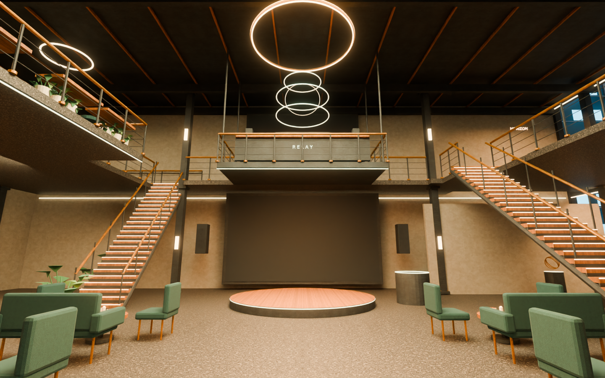

**画像はBlenderの実モデルレンダーです。Unity／VRChatでの撮影ではありません。** カート全景のみ、レイアウトを見せるため屋根・手前2面の壁・トラスを非表示にしています。Unity/Udonコンパイル・ベイク・実機プレイは未検証。モデル・ソースからシーンを生成する配布物です。

[リリースと全ダウンロード](https://github.com/Xenoah/vrcworld_tech-tech-cafe/releases/tag/v0.9.0) · [A3図面集PDF](Documentation/Design/The_Commons_v0.6.0_Design_Atlas.pdf) · [Unity導入の詳細](README_JA.md) · [Unity MCP引き継ぎ](UNITY_MCP_HANDOFF.md)

## v0.9.0 — ポータル案内・iwaSync用ステージ・照明3モード

Claudeのv0.8.0（`65c185a`、2026-10-08）を基準に更新しました。26コーナー・3層の走路、ジャンプ、バンク、FPV飛行エリア、ガラス・街並みを継承しています。

- **ポータル**：入口正面の左にシアンのFPV、右にピンクのKART。幅2.94 mのフレーム、大きな行き先名、床矢印、2.1 × 0.72 mのInteractボタンを設置。両エリアの帰路もCAFEと大きく表示。
- **ステージ**：内蔵スライド、15分/5分タイマー、Q&A、画面ポインター、動画URL UI・独自再生同期を撤去。演台・マイク・旧画面の文字も撤去し、iwaSync用の主画面・上階画面・配置アンカーを用意。
- **照明**：WARM／CYBER／DISCO + LASERSを入口とAV側で選択。時間帯・家具モードとは独立し、選択を同期。カフェ専用マテリアルでFPV・カート・街・ポータルの識別色への影響を分離。
- **レーザー**：PC 12本／Quest 6本。静かな色変化とゆっくりした走査、ストロボなし。REDUCED MOTION（既定ON）では静止、LASERS (LOCAL)で個別非表示、LOW EMISSIONで減光。

**iwaSync本体は別途導入・接続が必要です。** 本更新は既存プレゼン撤去と配置準備まで。内蔵BGM/DJループは初期OFFで、AV側のHOUSE MUSICから切り替えます。iwaSyncの音量・URL・同期はiwaSync側で操作します。

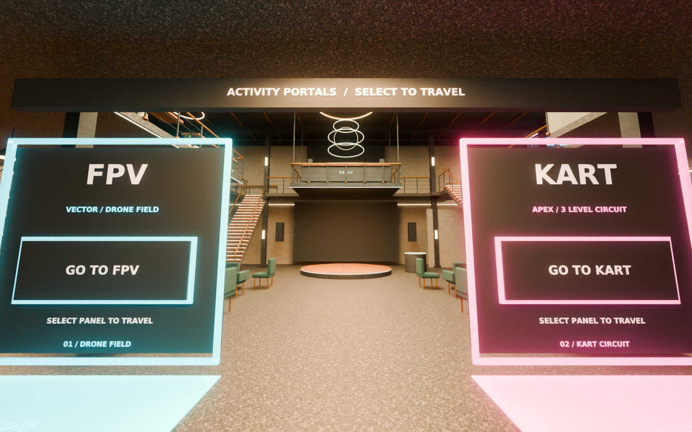

| 暖色 | サイバー | ディスコ |
| --- | --- | --- |
|  | 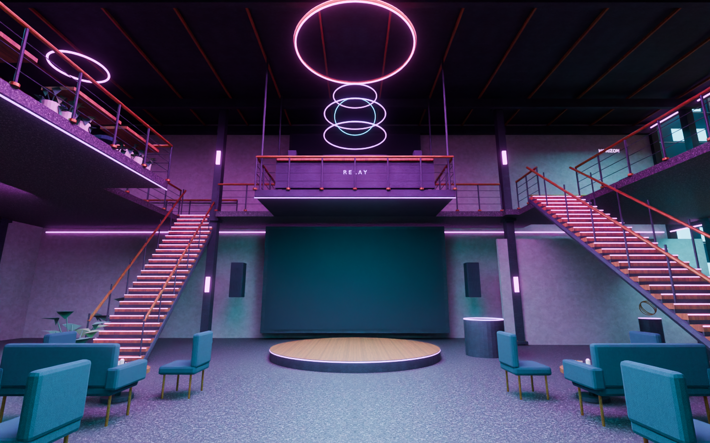 | 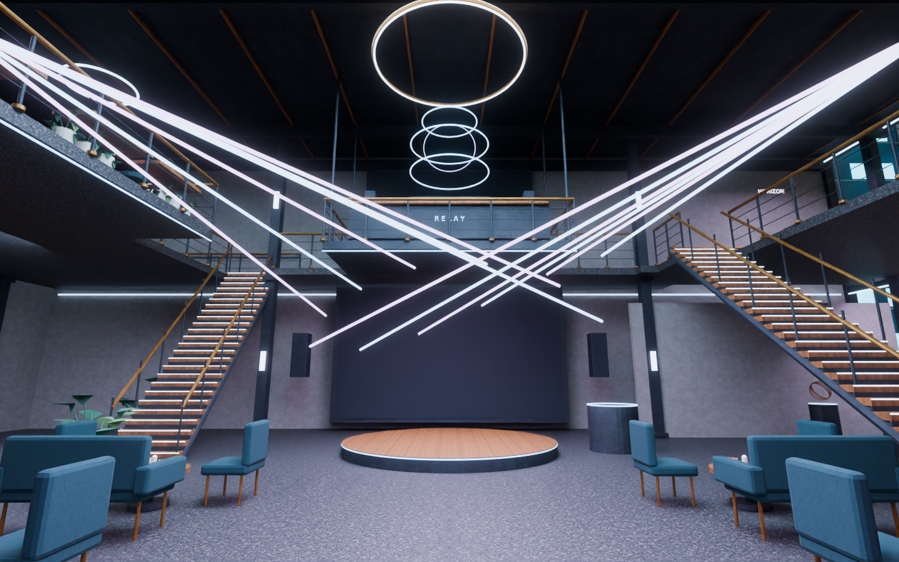 |

画像は更新モデルのBlenderレンダー。照明・レーザーはUnityの配色と配置を用いたデザイン確認で、Unity/VRChat実機の描画一致や動作を保証する画像ではありません。

[変更仕様・検証](Documentation/CHANGES_v0.9.0_JA.md) · [iwaSync接続手順](Documentation/IWASYNC_INTEGRATION_JA.md) · [モデル保持検証](Documentation/cafe_source_preservation.json) · [メッシュ差分検証](Documentation/cafe_update_validation.json)

## v0.8.0の更新履歴 — いろは坂型の複合7連ヘアピン・カルーセル・ジャンプ

v0.7.0のカートコースを、S字の続く「うねり」を減らして作り直しました。直線と性格のはっきりしたコーナーで組んだ **全長1,141.23 m・26コーナー・3層** のコースです。下りの7連ヘアピンは、いろは坂の地図を参考に、7つすべてを形の違う複合ヘアピンにしました。**カフェ・FPV・街並み・カートの建屋は変更していません**（Unity用メッシュのカート以外の記録がv0.7.0とバイト一致）。

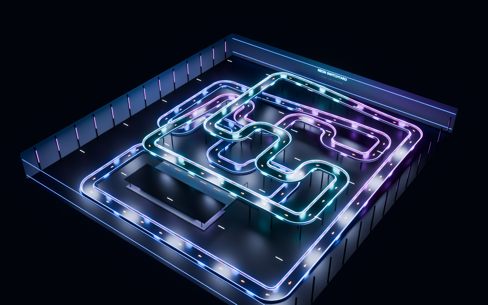

| 項目 | v0.7.0 | v0.8.0 |
| --- | --- | --- |
| 全長／コーナー | 1,002.31 m／33コーナー（46頂点） | 1,141.23 m／26コーナー（44頂点）、中心半径6.0〜20 m |
| 層の接続 | カルーセル、登坂、2層分の下りの3区間 | カルーセル74.9 m、ヘアピンからの登坂56.9 m、コークスクリュー52.4 m、いろは坂494.8 mの4区間 |
| 最大勾配／バンク | 10.60%／カルーセル最大8° | 11.92%（コークスクリュー）／カルーセル最大8° |
| 立体交差／ジャンプ | 最小3.37 m／なし | 3か所・最小3.37 m／2か所 |

| 注文 | 実装 |
| --- | --- |
| クッパ城のような直角コーナー | 上層T12〜T14、中層T17〜T18。半径6〜7 mの直角を長めの直線でつなぐ |
| モンツァのシケイン | T1〜T2。メインストレートの先で右・左 |
| ラグナ・セカのような下りのコークスクリュー | T14の頂上から路面が落ち、左T15・右T16で52 mの間に4.2 m下る |
| スパのようなヘアピン | T10。左183°・半径8 m。頂点から上層へ登る |
| 鈴鹿の立体交差 | 上層の城（T12〜T14）が峠の入口の脚とT19の上を渡る。T10後の登坂はT21の頂部の上、カルーセルは自身の入口の上を通る |
| 高速コーナー | T3（半径16 m）、T6〜T7（20 m）、T26（14 m）、バンク付きのT4カルーセル（12 m） |
| 下りの7連ヘアピン（いろは坂のように複雑に、複合ヘアピンで） | T19〜T25。平底の2頂点、涙滴形、半径が縮む、S字進入、2段、半径が広がる、2段のV字の7種類。12〜39 mの脚が斜めに折り返し、4.55→0.35 mを階段状に下る |
| ノルトシュライフェのような複雑なコーナー | T6〜T9。高速キンク、コンプレッション、右・左のフリック、ブラインドクレスト |
| ジャンプポイント | J1（T3後の下層、高さ0.75 m）、J2（T11後の上層、0.5 m）。路面に「JUMP」と踏切線 |
| 前版の「ぐるっと回る」カーブ | T4。バンク3°→8°→5°で360°登り、自身の入口の上を越える |

| 360°登坂カルーセル（T4） | いろは坂型の複合7連ヘアピン（T19〜T25） |
| --- | --- |
| 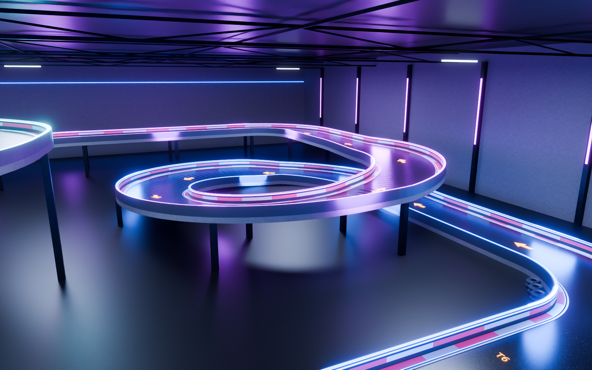 | 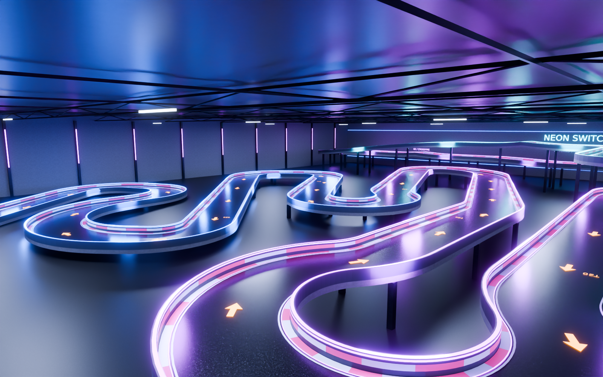 |
| **城の直角コーナー（T12〜T14）** | **コークスクリュー（T15〜T16）** |
| 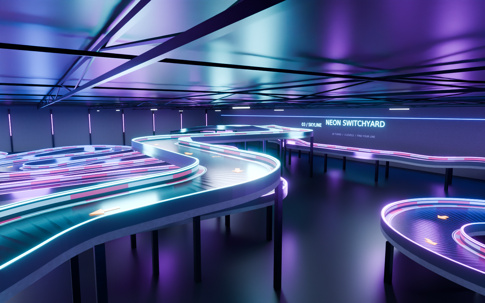 | 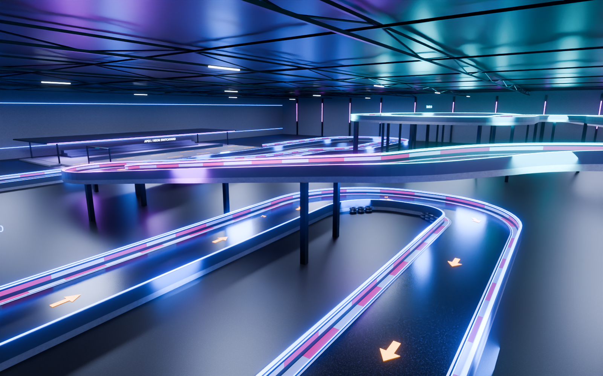 |

実在コース・道路・ゲームの再現ではなく、曲がる向き・半径の比・連続性・高低差を屋内カート用に縮小して取り入れています。会場内の表示は路面の「T1」〜「T26」「JUMP」と区画名だけで、サーキット名・ゲーム名・ロゴは使っていません。7つの複合ヘアピンの形と全26コーナーの半径・角度・参考は[変更仕様](Documentation/CHANGES_v0.8.0_JA.md)、頂点データは `SourceDesign/kart_circuit.json` にあります。

**新しいシーンの生成とライトの再ベイクが必要です。** CVS2配置ガイドがX方向に最大0.67 m移動しています（「4. APEX」参照）。

## v0.7.0の更新（前版）

90°・半径6 mの切り返しを並べた旧線形を、33コーナーのテクニカルコースへ改修した版です。内容は[CHANGES_v0.7.0_JA.md](Documentation/CHANGES_v0.7.0_JA.md)と[Release v0.7.0](https://github.com/Xenoah/vrcworld_tech-tech-cafe/releases/tag/v0.7.0)を参照してください。走路はv0.8.0で再度作り直しています。

## v0.6.1の更新（カフェ・照明・街並み）

### 1. スポーン背後の落下対策

南壁中央の開口に6面の安全ガラス、真鍮の縦枠、目線下の細い表示線、足元灯を追加しました。床から屋根まで1つのBoxColliderで覆い、両側の壁・床・屋根と重ねて、ガラスの継目も通り抜けられない形状にしています。

| 項目 | 仕様 |
| --- | --- |
| 開口幅／衝突範囲 | 開口5 m、衝突は幅5.12 × 高さ9.8 × 厚さ0.24 m |
| 衝突中心 | Unity `(14, 4.8, 0.125)` m |
| PC／Quest | どちらも安全ガラスの描画・衝突を保持 |
| 外景 | ガラスは影を落とさず、不透明な遮蔽物としても扱わない設定 |

スポーン位置、既存のワープ着地点・床・階段・着席位置は維持しています。Questで東側の装飾窓を省略する処理から、安全ガラスを分離しました。

### 2. 室内・全時間帯の明るさ

カフェ既存灯の出力を1.65倍、FPV／カートを1.35倍にし、BlenderとUnity生成用マニフェストへ反映しました。倍率は光源の設定値で、実機で測定した明るさではありません。

- 入口・中央ラウンジ・上階南通路に、ベイク用の補助灯を3灯追加。
- 東・北側にコーブ照明を配置し、床石・左官・木・鋼材の基準色を調整。
- 夜間環境光と昼夜の素材補助光を増やし、暗い面の見やすさを改善。
- カートの青紫色は維持し、路面補助光と固定Tintを明るく調整。
- Unityのベイク光強度上限を6→10に変更。プレビューの露出は従来値を維持。

### 3. 環境グロー

| 設定 | v0.6.0 | v0.6.1 |
| --- | ---: | ---: |
| PC Bloom intensity | 0.16 | 0.60 |
| Bloom threshold | 1.15 | 1.05 |
| Bloom soft knee / diffusion | 0.55 / 4 | 0.60 / 5 |
| PC 器具グロー 暖色／寒色 | 0.035 / 0.030 | 0.090 / 0.075 |
| Quest 器具グロー 暖色／寒色 | 0.028 / 0.023 | 0.060 / 0.050 |

器具グローの範囲を広げ、入口・テラスにも追加。PCの画面全体のBloomにはPost Processing Stack v2が必要です。Questは器具グローと発光材を使用し、SOFT GLOW／LOW EMISSIONは引き続きプレイヤーごとに調整できます。

### 4. 周辺建築

単純な30棟を、各3段のセットバックを持つ24棟へ変更しました。石の柱と水平帯、金属感のある不透明ガラス外装、暖色・寒色の窓、発光する冠部、屋上庭園、2本の空中回廊を配置。東テラスと南側のスポーンガラスから見える街並みを整えました。

高さは基部から22〜62 m。棟ごとの配置・高さは固定し、再生成しても変わりません。材質ごとに6メッシュへまとめ、追加テクスチャ・リアルタイム光源・衝突形状は使っていません。街並みは背景用で、屋上・空中回廊への歩行ルートやワープはありません。

### v0.6.1の実モデル画像

v0.6.1のRelease画像7枚のうち、カフェ・FPV・街並みの6枚です（Blender 4.5.3 / Cycles、Unity／VRChatの実機画像ではありません）。カート全景はv0.8.0のコースに更新しました。

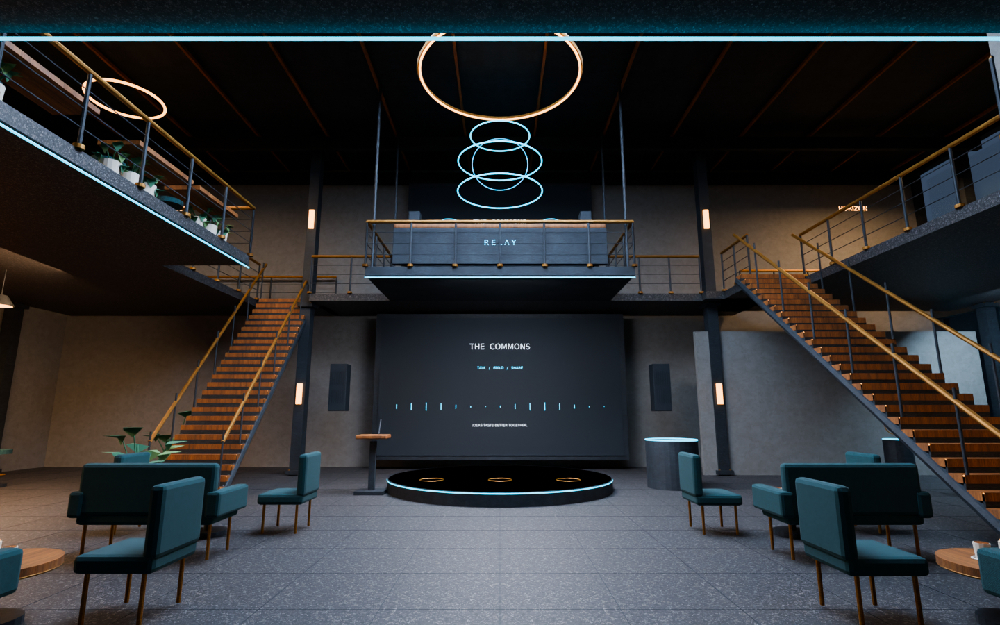

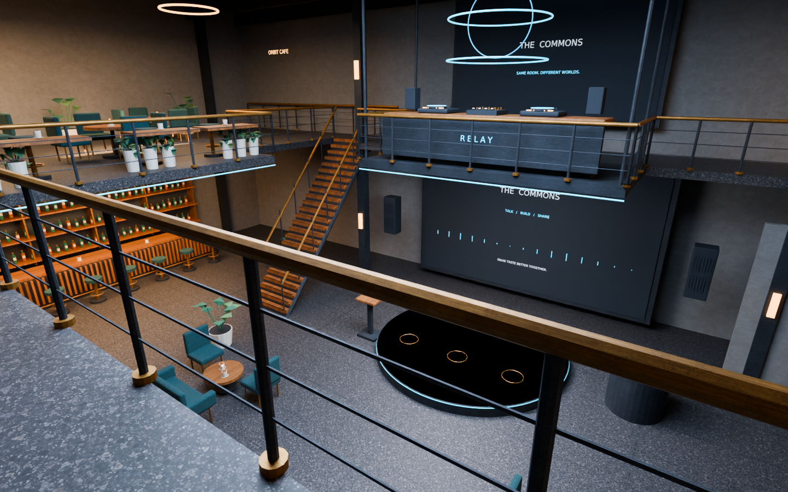

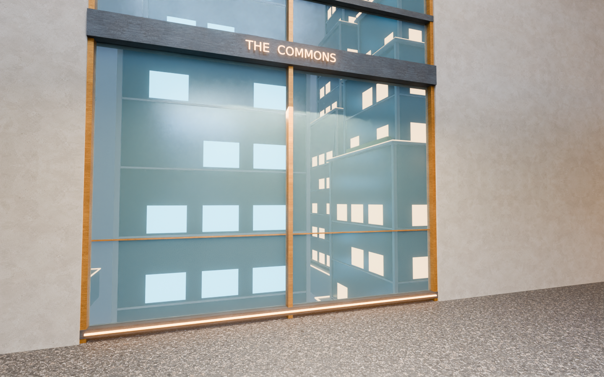

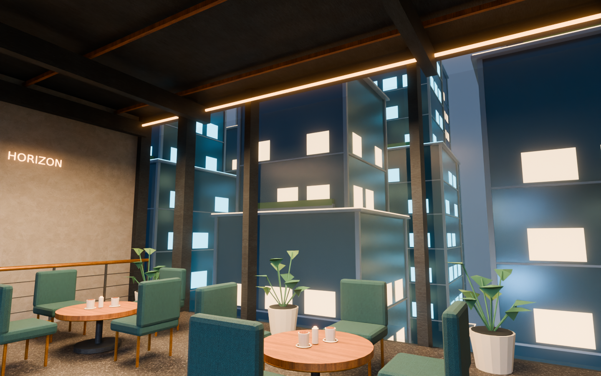

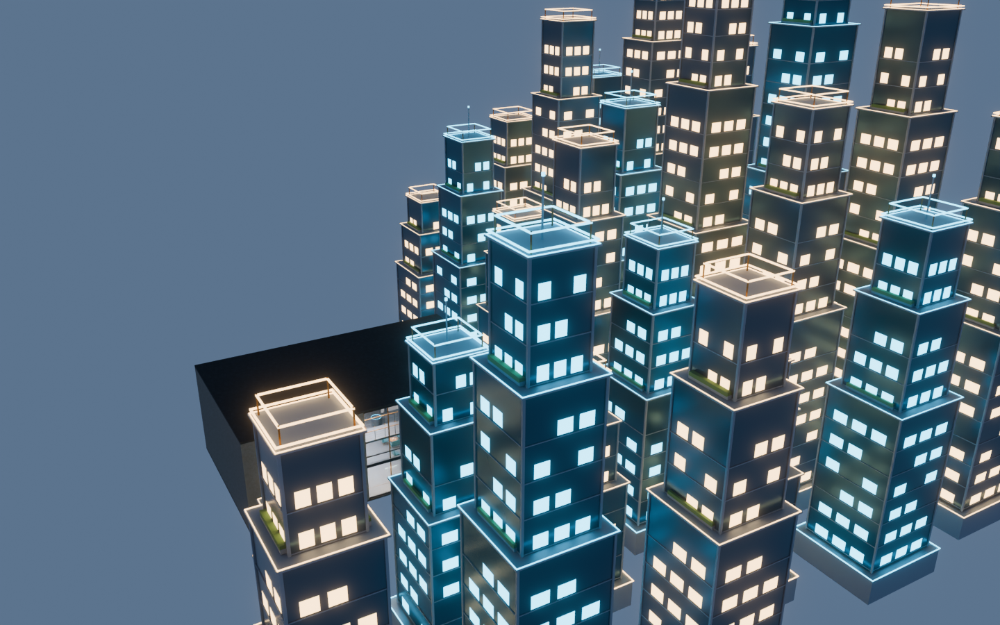

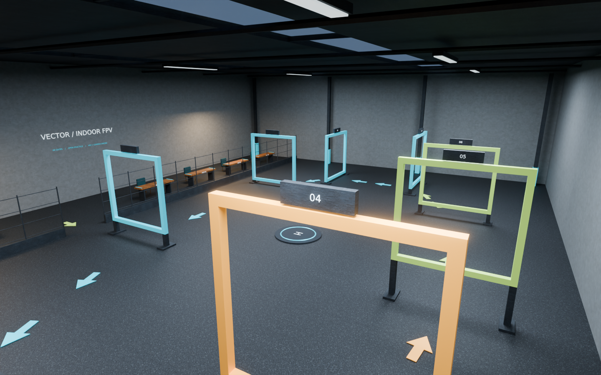

**適用にはシーンの再生成・ライトの再ベイクが必要です。** 導入手順は「導入・配布・編集」、細部は[変更仕様](Documentation/CHANGES_v0.6.1_JA.md)を参照してください。

## 1. 全体構成

| エリア | 外形・床面積 | 高さ | 主な用途 |
| --- | --- | --- | --- |
| THE COMMONS | 28 × 18 m、1F外形504 m² | 1F 0.00 m／2F +4.80 m、屋根下面9.60 m | バー・カフェ・学術発表・DJ・静かな会話 |
| VECTOR / Indoor FPV | 36 × 26 m、936 m² | 天井高8.00 m | VRC+ Camera Droneの練習・飛行・観戦 |
| APEX / NEON SWITCHYARD | 148 × 160 m、23,680 m² | 路面+0.35／+4.55／+8.75 m、壁高15.50 m | CVS2用の3層テクニカルカートコース |

カフェを中心にFPVとカートへ往復します。3エリアは離れた位置に置き、移動はInteract式ワープです。**生成シーンの定員設定は32人**。元設計資料の48／64人は計画値で、実機で成立を確認した人数ではありません。床面積は建築外形による値で、家具を除いた有効面積や2Fの床面積とは異なります。

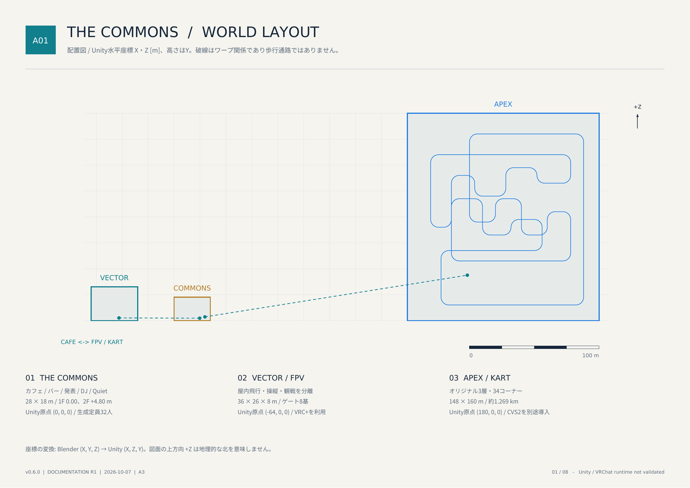

### 座標とワープ

設計JSON／Blenderは `(X, Y, Z)`、Unityは `(X, Z, Y)` に変換します。以下はすべて **Unity `(X, Y高さ, Z)`、メートル** です。

| 項目 | 座標・範囲 |
| --- | --- |
| カフェ外形 | X 0〜28、Z 0〜18 |
| FPV外形 | X -64〜-28、Z 0〜26 |
| カート外形 | X 180〜328、Z 0〜160 |
| 初期スポーン | `(14, 0.10, 1.20)` |
| カフェ → FPVの着地点 | `(-42.50, 0.12, 2.00)` |
| FPV → カフェの着地点 | `(11.00, 0.12, 2.00)` |
| カフェ → カート観戦側の着地点 | `(231.31, 0.42, 15.00)` |
| カート → カフェの着地点 | `(17.00, 0.12, 2.00)` |
| カフェ上下階 | 入口側と西階段脇に往復ポータル |

## 2. カフェ・バー・発表空間

| 場所 | 現在の仕様 |
| --- | --- |
| ANCHOR / 西側バー | L字カウンター、11脚の装飾スツール、木リブ、真鍮足掛け、棚下灯、93本のボトルに6種類のラベル |
| 1Fカフェ | テーブル・6着席アンカー、エスプレッソ機、グラインダー、カップ、ソーサー、コーヒー袋 |
| 中央ラウンジ | 4クラスタ・12着席アンカー。Academicでは24席の観客配置へ切替 |
| 中央ステージ | 直径4.80 m、高さ0.25 m。幅1.50 mのアクセス斜面。演台・マイク・発表者マークは撤去 |
| 主画面／上階補助画面 | 7.10 × 4.00 m／5.68 × 3.20 m。iwaSync用の空画面。別途プレハブ設置・接続 |
| OPEN LAB / 東側ギャラリー | 差替可能なポスター6面、デモ展示台4台 |
| 1F Quiet Nook | 半開放の小休憩スペース、4着席アンカー |
| ORBIT / 2F西カフェ | テーブル・12着席アンカー。吹抜けに面した滞在場所 |
| RELAY / 吊り下げDJブース | 2デッキ・4chの装飾モデル、ジョグ・ノブ・フェーダー・パッド・印刷面。実ミキサー操作は未実装 |
| HORIZON / 2F東テラス | 外景を望む席、8着席アンカー |
| ARCHIVE / 2F Quiet Room | 本棚・印刷入りの本・4着席アンカー。BGMとプレイヤー音声をローカルに減衰 |
| AV / HOST | ホスト操作パネル、照明選択、HOUSE MUSIC、iwaSync配置アンカー、機材ラック |
| 階段・上階回遊 | 東28段・36.44°、西25段・48.14°、各幅1.50 m。南北の橋で上階を接続 |
| 床・落下防止 | 上階床厚0.20 m、手すり1.05 m／衝突範囲1.30 m。スポーン背後に安全ガラス6面と幅5.12 × 高さ9.8 × 厚さ0.24 mの連続衝突範囲 |

**着席アンカーはカフェ常設34、Lounge用12、Academic用24、FPV用7の計77。** 中央の12席と24席は切替なので同時には有効になりません。カートの観戦段・バーのスツールは形状のみで、着席アンカーを追加していません。着席は明示的なInteractで行います。

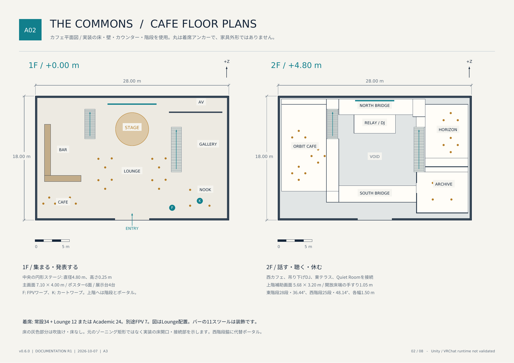

西階段は元CADの枠を維持した急勾配です。実機で登れない場合も脇のポータルで上下できます。図面の丸は着席アンカーの記号で、家具の輪郭ではありません。補完した上階接続・床開口・画面寸法は [CAD_CHANGES_JA.md](Documentation/CAD_CHANGES_JA.md) に記録しています。

## 3. VECTOR / 屋内FPV

| 項目 | 現在の仕様 |
| --- | --- |
| 飛行範囲 | ローカルX 1〜35、Z 6.2〜25 m。34 × 18.8 m＝639.2 m² |
| 操縦場所 | 南側X 2〜19、Z 1〜5 m。4着席アンカー |
| 観戦場所 | 南側X 23〜34、Z 1〜5 m。3着席アンカー |
| 人用動線 | 操縦／観戦を分けた配置、柵、境界を通る人用通路 |
| ゲート | 8基、開口3.20 × 3.00 m、フレーム厚0.18 m。開口を塞がない個別の衝突形状 |
| 誘導 | シアン・アンバー・ライムの区間色、番号、床の方向矢印 |
| 練習設備 | 中央の低い着地台、操縦・観戦側からの見通し |
| 外部機能 | VRC+ Camera Droneを利用。独自ドローン、操縦物理、レース計時は同梱なし |

ゲート中心は **フロア南西隅を原点としたローカル `(X, Z)`**。高さは床0 mからの値です。

| ゲート | 平面位置X／Z [m] | 進行方向 | 中心高 [m] | 開口下端〜上端 [m] | 色 |
| --- | --- | --- | ---: | --- | --- |
| 01 | 10／9 | +X | 1.90 | 0.40〜3.40 | シアン |
| 02 | 21／9 | +X | 2.30 | 0.80〜3.80 | シアン |
| 03 | 30／13 | +Z | 3.30 | 1.80〜4.80 | アンバー |
| 04 | 27／21 | -X | 3.50 | 2.00〜5.00 | アンバー |
| 05 | 20／22 | -X | 3.00 | 1.50〜4.50 | ライム |
| 06 | 11／21 | -X | 2.20 | 0.70〜3.70 | ライム |
| 07 | 6／18 | -Z | 2.10 | 0.60〜3.60 | シアン |
| 08 | 6／12 | -Z | 1.80 | 0.30〜3.30 | シアン |

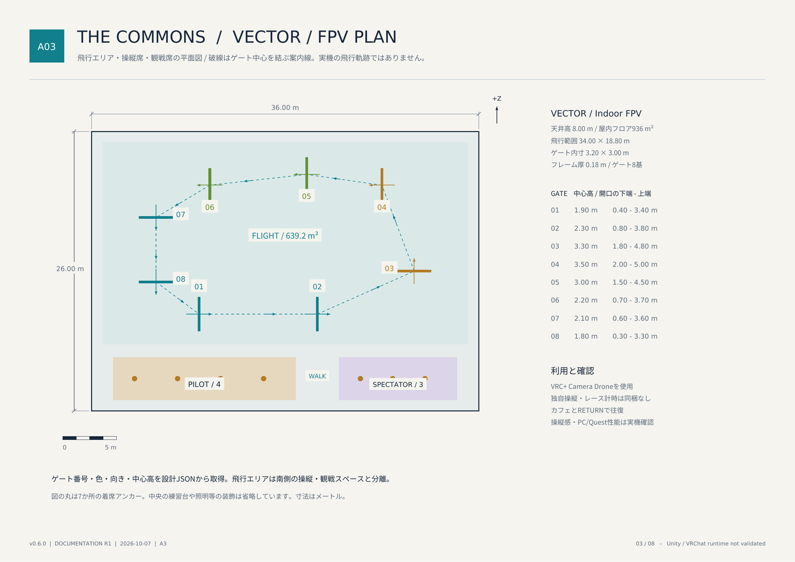

ワールド／インスタンスのDrones許可を確認して利用します。半径0.16 mの仮想球で開口とゲート間の中心経路を検査済み。実ドローンの操縦感・フレーム時間・快適性はPC／Quest実機で確認してください。

## 4. APEX / NEON SWITCHYARD

写真の密度・青紫の光を参考にした屋内空間に、**実在サーキット・峠道・ゲームのコースのコーナーの性格を取り入れた独自の走路**を通しています。v0.8.0で走路を作り直し、シケイン、高速コーナー、2か所のジャンプ、バンク付きの360°登坂カルーセル、ノルトシュライフェ型の複合区間、スパ型ヘアピン、クッパ城型の直角、コークスクリュー型の下り、いろは坂型の複合7連ヘアピンを3層に配置しました。

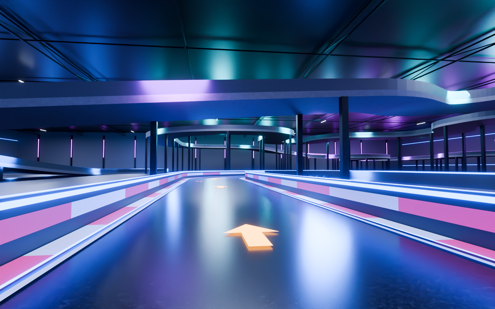

| 項目 | 現在の仕様・検査値 |
| --- | --- |
| 全長／コーナー | 1,141.23 m／26コーナー（44頂点）。中心半径6.0〜20 m（T11の緩いキンクを除く）、複合ヘアピン7つ、カルーセル360° |
| 走行幅／構造幅 | 5.20 m／デッキ6.50 m |
| 旋回半径 | 中心線の最小約6.00 m（T1・T2・T13・T14・T18と、T19・T21・T23・T24の小さい側の円弧）、走行幅内縁は約3.40 m。最大20 m（T6・T7） |
| 低層 REACTOR | 路面+0.35 m、青のガイド。シケイン・高速左・J1ジャンプ・カルーセル入口・最終高速左 |
| 中層 CROSSFIRE | 路面+4.55 m、紫のガイド。カルーセル出口・ノルトシュライフェ型区間・スパ型ヘアピン・直角の門と峠入口 |
| 上層 SKYLINE | 路面+8.75 m、シアンのガイド。J2ジャンプ・クッパ城型の直角3つ・コークスクリューの頂上 |
| 高低差の接続 | 4区間。カルーセル74.9 m（0.35→4.55 m）、T10後の登坂56.9 m（4.55→8.75 m）、コークスクリュー52.4 m（8.75→4.55 m）、いろは坂494.8 m（4.55→0.35 m。複合ヘアピンは平らで、脚で0.45〜0.6 mずつ下る） |
| 最大勾配／バンク | 11.92%（コークスクリュー）／カルーセルのみ最大8°（入口3°・出口5°） |
| 起伏 | J1ジャンプ高さ0.75 m・長さ26 m、J2 0.5 m・18 m、T6出口のコンプレッション0.45 m、T9出口のブラインドクレスト0.4 m。ジャンプの真上に他の路面なし |
| 立体交差 | 3か所。橋下面とのクリアランスは、カルーセルが自身の入口の上で3.37 m、城が峠の入口の脚とT19の上で4.22 m、T10後の登坂がT21の上で5.20 m |
| デッキ／ガード | デッキ厚0.40 m／ガード高0.75 m |
| 支柱／路面分割 | 路面を避けた支柱129本／中心線1,791点、間隔最大0.65 m |
| 建屋 | 全面屋根、外壁、鉄骨トラス。壁高15.50 m |
| ピット | メインストレート南側に6台分の空のCVS2配置ガイド、番号・区画線、両端の歩行接続 |
| 観戦 | 3段の観戦席、約48 × 15 mの観戦デッキ、屋根、帰還ボタン、時間パネル |
| 路面・装飾 | 黒い光沢路面、ラバーガード、ピンク／白のパネル・縁石、路面のターン番号T1〜T26、ジャンプ手前の「JUMP」と踏切線、下層コーナー内側の床置きタイヤ24個 |
| 光・誘導 | ガードの上端／側面LED、路面ガイド、紫の壁面灯、斜面・バンクに沿う琥珀色の進行矢印、チェッカー |
| 照明の作成値 | レール補助93灯＋天井25灯＋ピット3灯。Unityではベイク用Point Lightとして生成 |
| 当たり判定 | 路面とガードは連続した静的MeshCollider（バンク・ジャンプを含む）。支柱等はBoxCollider。PC／Questで走行形状共通 |

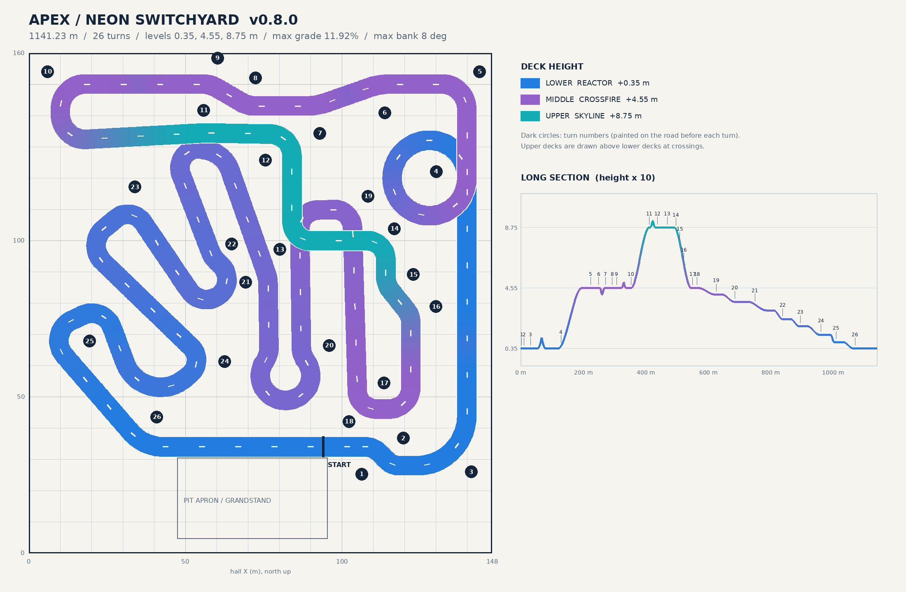

平面図は中心線データから作図し、高さを色、ターン番号を白で示しています。全26コーナーの半径・角度・参考にしたコーナーは[変更仕様](Documentation/CHANGES_v0.8.0_JA.md)を参照してください。

### CVS2の導入範囲

CVS2本体・車両モデル・操縦・車両同期・レース管理は同梱していません。所有者が取得したCVS2を導入後、`KART_ExternalVehicleAnchors/CVS2_Bay_01`〜`06` の空Transformを目安に車両を配置します。車高・タイヤ・旋回・速度・衝突レイヤー・復帰設定は車両側で調整してください。

6ガイドのUnity高さは0.47 m、Zは25.60 m。Xは230.775／238.512／246.894／254.632／263.014／271.395 m（v0.7.0から最大0.67 m）、向きはY軸90°です。これは配置の目安で、車両のスポーンやリセット機能ではありません。詳細は [CVS2_INTEGRATION_JA.md](Documentation/CVS2_INTEGRATION_JA.md)。

| メインストレートからT1シケインへ（運転視点） | T6〜T9 ノルトシュライフェ型区間 | T10 スパ型ヘアピン |
| --- | --- | --- |
| 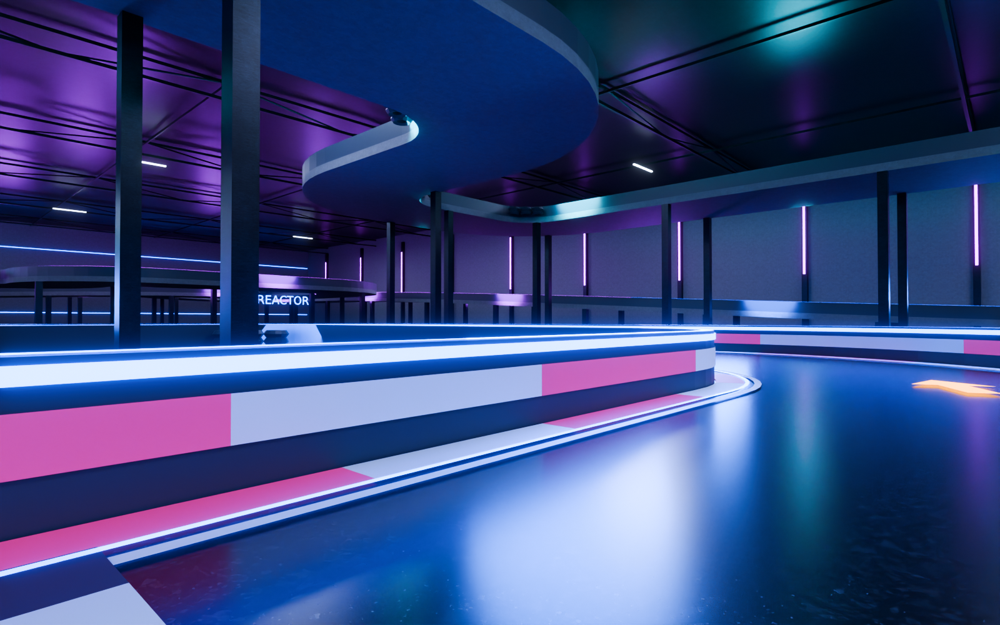 | 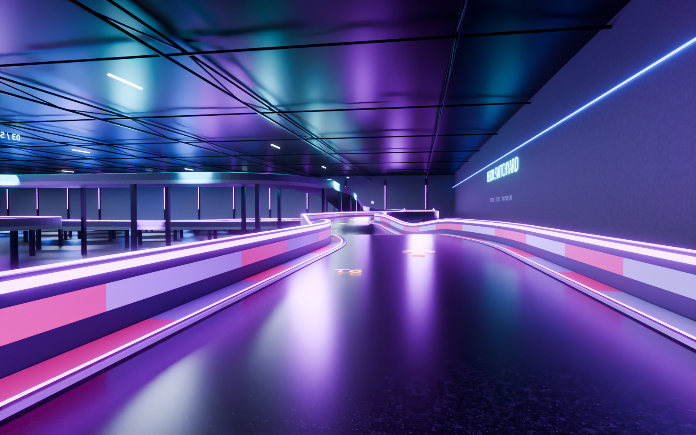 | 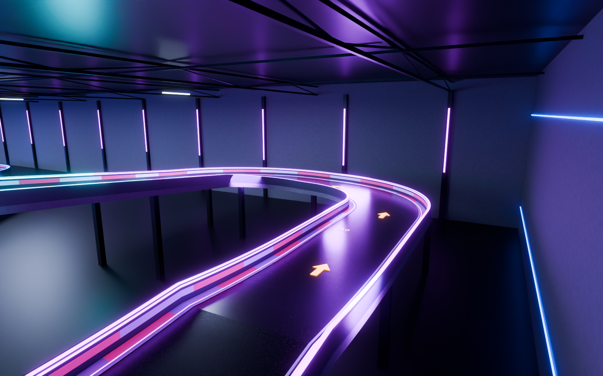 |
| **J1ジャンプ** | **ピット・観戦席** | |
| 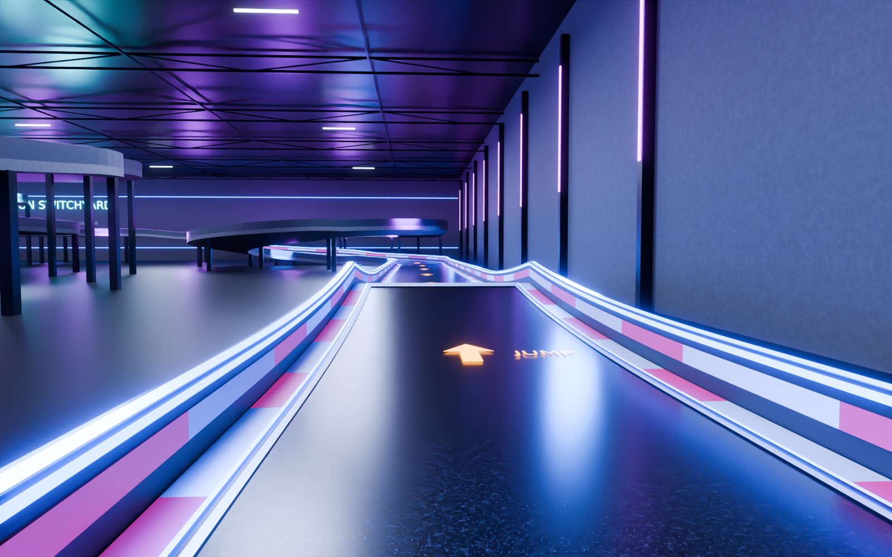 | 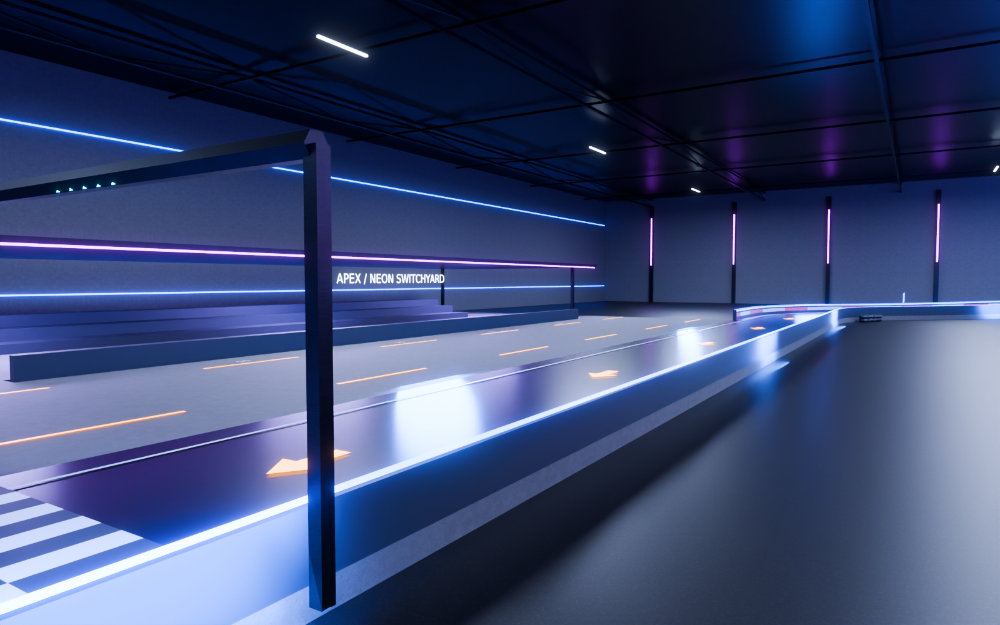 | |

## 5. 共有操作・ローカル操作

### 活動モード

| モード | 中央配置 | 主な振る舞い |
| --- | --- | --- |
| Lounge（初期） | 4クラスタ・12着席ポイント | 会話用BGMと通常表示 |
| Audience | 24席 | 観客配置、ホログラム非表示。発表操作は撤去 |
| DJ / Live | 中央家具を非表示 | DJビジュアル。内蔵音源はHOUSE MUSICをONにした場合 |
| Quiet Night | Lounge配置 | 発光量とBGMを抑制 |

共有操作は初期設定でインスタンス所有者またはMasterに限定。変更時に所有権を取得して同期します。権限は `hostLocked` で設定。活動モードと時間帯は別の状態です。

| 機能 | 操作・実装 |
| --- | --- |
| メディア | iwaSync用の空画面・配置アンカー。iwaSyncを別途導入し、その標準UIで操作 |
| 照明 | WARM / CYBER / DISCO + LASERS。Manual Syncで選択を共有 |
| レーザー | PC 12本 / Quest 6本。有限長の交差リボン。ローカル非表示・静止・減光に対応 |
| 着席 | Interact式。通り過ぎるだけでは着席しない |
| ローカル快適設定 | REDUCED MOTION（初期ON）、LOW EMISSION、DJ VISUALS、SOFT GLOW、LASERS (LOCAL) |
| ローカル鏡 | PCのみ、初期OFF。SDKの鏡シェーダーが見つからない場合は作成を省略 |
| 話題カード | 4つの短い問いをローカルで切替 |

### 音と時間帯

- オリジナルの環境音・アンビエント・96 BPMのDJループを収録。内蔵BGM／DJ音源は初期OFF。HOUSE MUSICでホストが切り替えます。
- Quiet Room内では内蔵BGMを減衰。iwaSync音声はiwaSync側で設定します。別の部屋／エリアにいるプレイヤー音声は、初期設定でGain 5・Far 8 m、同じ側はGain 15・Far 18 mへ調整します。防音やプライバシーを保証する仕組みではありません。
- カフェ・FPV・カート観戦側に時間パネル。DAWN 6時／DAY 12時／DUSK 18時／NIGHT 0時、±1時間、CYCLE／HOLDを操作。初期時刻20時、連続サイクルは24分で1日です。
- 空・太陽・霧・環境色・素材の補助光を連続補間し、時刻と起点を共有します。ライトマップと反射は静的1組です。
- カート室内のマテリアルは固定の青紫色・発光。室内滞在中の霧と環境色も固定し、外の時間帯で雰囲気を変えません。LOW EMISSION等のローカル設定は有効です。

以下の4枚は旧版の時間帯表現の参考です。v0.6.1では環境光・素材補助光を明るく調整しています。

| 朝 | 昼 | 夕 | 夜 |
| --- | --- | --- | --- |
|  | 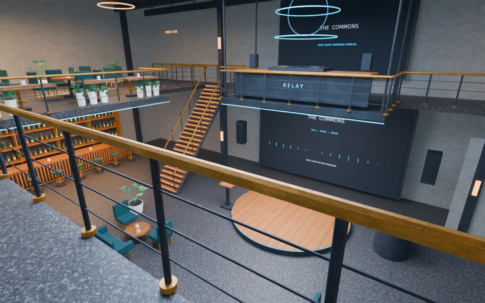 | 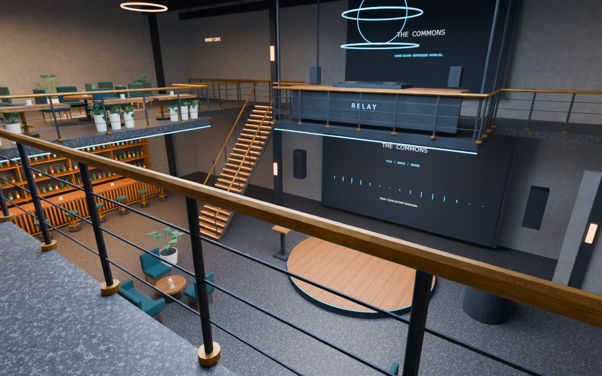 |  |

## 6. 描画・素材・PC／Quest

| 項目 | PC | Quest |
| --- | --- | --- |
| 建築・家具 | PBR、金属度・粗さ、弱い微細法線 | 軽量な明暗とハイライト、ベイク光 |
| 窓ガラス | Fresnelとベイク反射。透明面の影・不透明遮蔽を無効化 | スポーン安全ガラスを保持。東側装飾窓の描画は省略、衝突を保持 |
| グロー | 拡大した器具グローカード＋任意のBloom | グローカード。Post Processingなし |
| 反射プローブ | カフェ・FPV・カートに各1、128 px、Box Projection、ベイク | 作成しない |
| 太陽 | Realtime Directional Light 1灯 | シェーダー側の補助色・方向 |
| ライトマップの生成設定 | 20 texels/m、最大2048 | 12 texels/m、最大1024 |
| 共通の照明 | ベイクGI有効、Realtime GI無効、Progressive CPU。直接32／間接64／環境64サンプル | 同左 |
| 建築素材の取込上限 | 1024 | 512 |
| 描画距離 | Reference Camera far clip 900 m、near 0.03 m | 同左 |

BloomはPost Processing導入時に生成します。強度0.60、閾値1.05、Soft Knee 0.60、Diffusion 5、Fast Mode。未導入なら器具グローのみ。カートの広い床・屋根・外壁にはライトマップ密度の倍率0.08、他のカート部材には0.4、背景の街並みには0.05を設定しています。ベイク光の強度上限は10です。

建築テクスチャ6種は木・左官・テラゾー・黒皮鋼・真鍮・織布。DJ・酒ラベル・小物用アトラス3種を加え、原本は計9画像です。建築素材はMirror、印刷用アトラスはClamp。元画像の左右・上下端がRepeatで完全一致するとは保証していません。

エリア移動時は遠い側の建築Rendererをローカルで非表示にします。コライダーとUdonは維持し、各エリアのアセットはメモリに残ります。外部CVS2車両をこの建築Renderer配列に登録しないでください。AudioLinkは任意の外部導入で、DJシェーダーは4バンドを参照します。

### 書き出し形状の実測

| 対象 | PC三角形数 | PCメッシュ数 | Quest三角形数 | Questメッシュ数 |
| --- | ---: | ---: | ---: | ---: |
| ワールド全体 | 307,333 | 208 | 256,204 | 200 |
| うち街並み | 30,236 | 6 | 18,804 | 6 |
| うちFPV | 19,944 | 22 | 14,331 | 21 |
| うちカート | 111,457 | 36 | 106,028 | 36 |

メッシュ数は書き出し単位で、Unityの描画回数やSetPass数ではありません。PC／Quest実機のFPS・メモリ・配信サイズは未測定です。

## 7. 平面図・デザイン画

以下は**v0.6.0の過去資料**です。カフェ・FPVのフロア寸法は継続していますが、**A04・A05・D03のカートは旧コース**です。v0.8.0のカートは上記の平面図と[カートDXF](CAD/APEX_Kart_Neon_Switchyard_v08.dxf)、v0.6.1のガラスを含む全体の衝突形状は[最新衝突CAD](CAD/The_Commons_Implementation_Overlay_v080.dxf)、照明と街並みはv0.6.1の画像を参照してください。

**[A3横・8ページの図面集PDF](Documentation/Design/The_Commons_v0.6.0_Design_Atlas.pdf)** ／ **[追加資料一式ZIP](https://github.com/Xenoah/vrcworld_tech-tech-cafe/releases/download/v0.6.0/The_Commons_v0.6.0_Docs_r1.zip)**

| シート | 内容 | PNG | SVG |
| --- | --- | --- | --- |
| A01 | 3エリアの配置・ワープ・座標 | [配置図](Preview/Design/01_World_Layout.png) | [ベクター](CAD/Plans/01_World_Layout.svg) |
| A02 | カフェ1F・2F、床開口、階段、着席位置 | [平面図](Preview/Design/02_Cafe_Floor_Plans.png) | [ベクター](CAD/Plans/02_Cafe_Floor_Plans.svg) |
| A03 | FPV領域・8ゲート・高さ・席 | [平面図](Preview/Design/03_FPV_Floor_Plan.png) | [ベクター](CAD/Plans/03_FPV_Floor_Plan.svg) |
| A04 | カート全周・高さ別の色分け・ピット | [総合平面図](Preview/Design/04_Kart_Overall_Plan.png) | [ベクター](CAD/Plans/04_Kart_Overall_Plan.svg) |
| A05 | カート各層・縦断図・標準断面 | [層別図](Preview/Design/05_Kart_Levels_Profile.png) | [ベクター](CAD/Plans/05_Kart_Levels_Profile.svg) |
| D01 | カフェの空間・機材・素材 | [デザイン画](Preview/Design/06_Cafe_Design.png) | — |
| D02 | FPVの視認性・区間色・観戦 | [デザイン画](Preview/Design/07_FPV_Design.png) | — |
| D03 | カートのネオン・橋下・上層 | [デザイン画](Preview/Design/08_Kart_Design.png) | — |

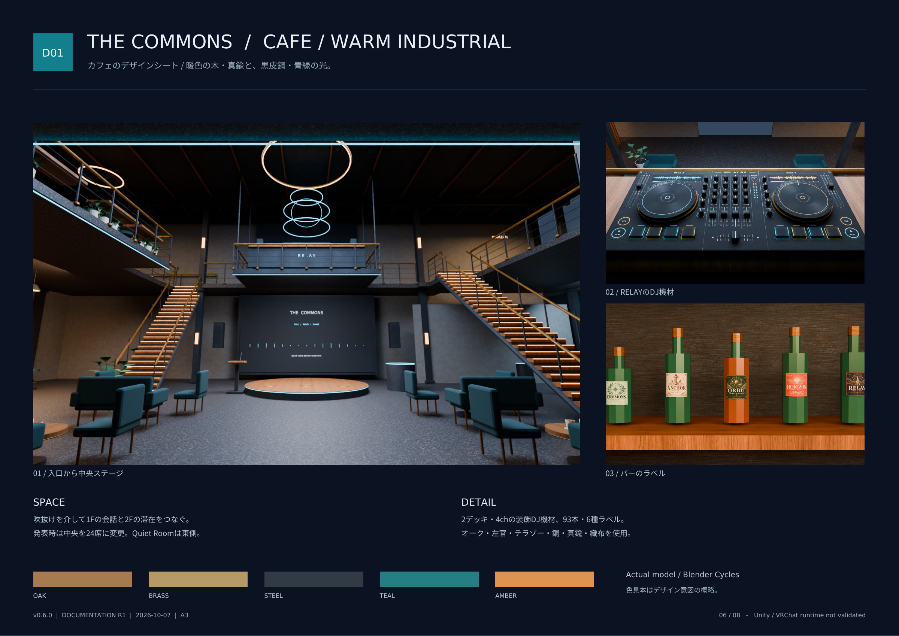

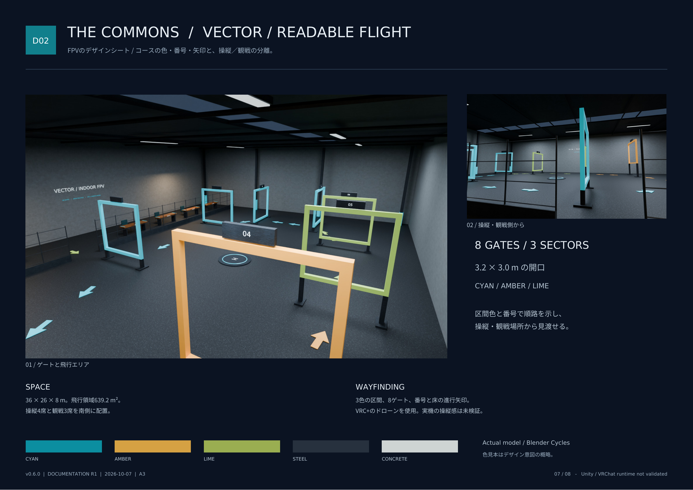

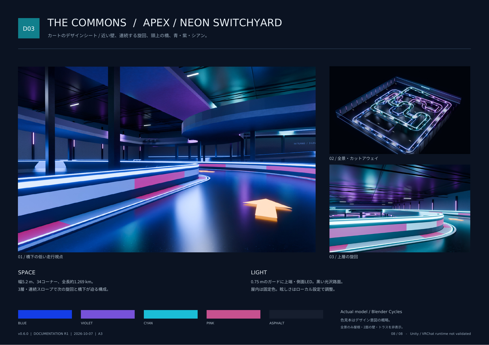

編集用DXF: [カフェ1F・2F](CAD/The_Commons_Cafe_Floors_v06.dxf) ／ [FPV](CAD/VECTOR_FPV_Plan_v06.dxf) ／ [カート v0.8.0](CAD/APEX_Kart_Neon_Switchyard_v08.dxf)（旧コースは[v0.7](CAD/APEX_Kart_Neon_Switchyard_v07.dxf)・[v0.6](CAD/APEX_Kart_Neon_Switchyard_v06.dxf)）。DXF単位はmm。カフェDXFの2Fは並列表記のためX方向に38,000 mmずらしています。FPV DXFはフロアローカル、カートDXFはBlenderのワールド平面座標です。

平面図は現行の床・壁・衝突形状・着席アンカー・中心線データから作成した実装説明図です。装飾・小物は省略。カートの縦断図は高さを拡大し、断面は寸法関係の模式図です。デザイン画は**実モデル画像を編集配置した資料**で、追加の建築案や生成AIの想像図ではありません。色見本はデザイン意図の概略です。

## 8. 導入・配布・編集

1. VCCでWorlds / Built-in Render Pipelineのプロジェクトを作成。制作時の基準は **Unity 2022.3.22f1／VRChat SDK 3.10.5**。現在の対応版はVCC・公式の指定に従ってください。
2. [v0.8.0のUnityパッケージ](https://github.com/Xenoah/vrcworld_tech-tech-cafe/releases/tag/v0.8.0)をインポートするか、`Unity/Assets/TheCommons` と `.meta` をコピー。SDK・UdonSharpはVCC側で導入します。
3. PCのBloomを使う場合は `com.unity.postprocessing@3.4.0` を導入。**The Commons → Build PC World** または **Build Quest World** を実行します。
4. シーンは `Assets/TheCommons/Generated/PC_日時/` または `Quest_日時/` に新規作成。CVS2／AudioLinkを使う場合は所有者側で追加します。
5. **The Commons → Bake lighting**、VRChat SDKのBuild & Test、PC／Quest・複数人での確認を行います。アップロードやBlueprint IDは所有者が管理します。

| 配布物 | 用途 |
| --- | --- |
| `The_Commons_Compact_v0.9.0.unitypackage` | Unityへインポートするモデル・素材・Editor・UdonSharp・シェーダー |
| `The_Commons_Compact_v0.9.0_Full.zip` | v0.9.0の制作データ。Blender・CAD・設計・再生成ソース・新規カフェ画像5枚と過去画像 |
| `The_Commons_v0.6.0_Design_Atlas.pdf` | v0.6.0のA3図面集8ページ（過去資料） |
| `The_Commons_v0.6.0_Docs_r1.zip` | v0.6.0の詳細README・図面・デザイン画・設計根拠（過去資料） |
| `SHA256SUMS-v0.9.0.txt` | 公開済みモデル配布物・画像のチェックサム |
| `SHA256SUMS-v0.6.0-docs-r1.txt` | v0.6.0追加資料・画像のチェックサム |

v0.8.0ではカートの走路・カート生成ソース・カート画像を更新しました。最新の制作データはv0.9.0 Full.zipとmainに収録しています。v0.7.0以前のタグ・過去配布物は保持しています。

`.blend` は圧縮保存し、画像とフォントをリポジトリ内の相対パスで参照します。Blender編集時はFull.zipを全体展開するかリポジトリごと取得してください。プレビューモデルは [glTF](Preview/The_Commons_Compact.gltf) と [.bin](Preview/The_Commons_Compact.bin)。ブラウザ歩行ビューアは別プロジェクトです。

再生成手順・素材差替は [README_JA.md](README_JA.md)。図面集の作成は `Blender/build_design_atlas.py`。Pythonのreportlab／Pillow／numpy／fonttools／ezdxfとPoppler、Noto Sans CJK JPのOTFが必要です。`COMMONS_JAPANESE_FONT` でフォントパスを指定できます。PDFには日本語フォントを部分埋め込みしています。

## 9. 検証状況と正本

| 区分 | 現在地 |
| --- | --- |
| 実施済み | 共通形状46項目＋カート18項目、PC／Questメッシュデータ、v0.8.0の既存7,911オブジェクト保持、メッシュ差分37項目、C#構文14ファイル、メタデータ、モデル配布物の内容一致、実モデル画像の確認 |
| 今回の画像 | v0.9.0のカフェ画像5枚をBlender 4.5.14 / Cyclesでレンダリングして目視確認。カートはv0.8.0、FPV・街並みはv0.6.1の画像を保持。v0.6.0の8ページ図面集は過去資料として同梱 |
| 未実施 | Unity/Udon・シェーダーのコンパイル、Unityライトベイク、VRChat Build & Test、CVS2実走（新コース全周・ジャンプ・バンク・登坂・下り・7連ヘアピン）・同期、VRC+実飛行、VR両眼、Quest実機性能 |

[共通形状検査](Documentation/validation_report.json) · [カート形状検査](Documentation/kart_validation.json) · [モデル計測](Documentation/geometry_report.json) · [Unity実機受入表](Documentation/ACCEPTANCE_JA.md) · [図面の入力・版情報](Documentation/Design/atlas_manifest.json)

元の `SourceDesign/world_spec.json` には初期コンセプトの人数・機能案も残しています。現行形状は `Documentation/model_manifest.json`、Unity用変換は `Unity/Assets/TheCommons/Data/world_manifest.json`、生成機能はC#ソース、FPV／カートの配置は各設計JSONと検査報告を参照してください。

SDK・UdonSharp・AudioLink・CVS2・車両本体は同梱していません。フォントの権利表記は [DejaVu](Documentation/DejaVu_Font_License.txt) と [Noto](Documentation/Noto_Font_License.txt)。画像の生成・素材履歴は [texture_provenance.json](Documentation/texture_provenance.json)。
