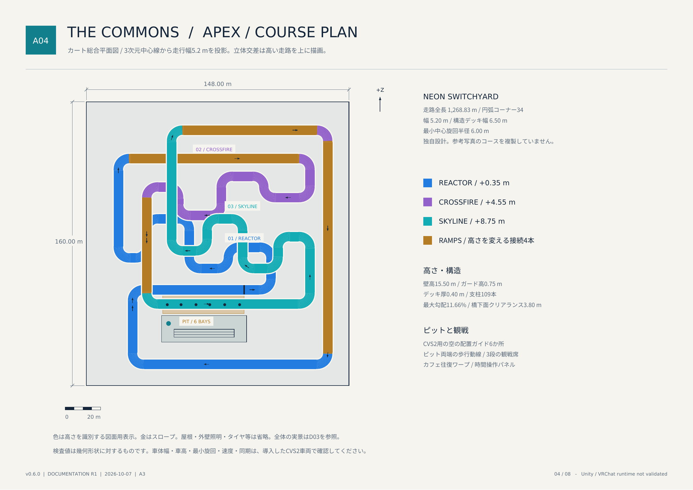
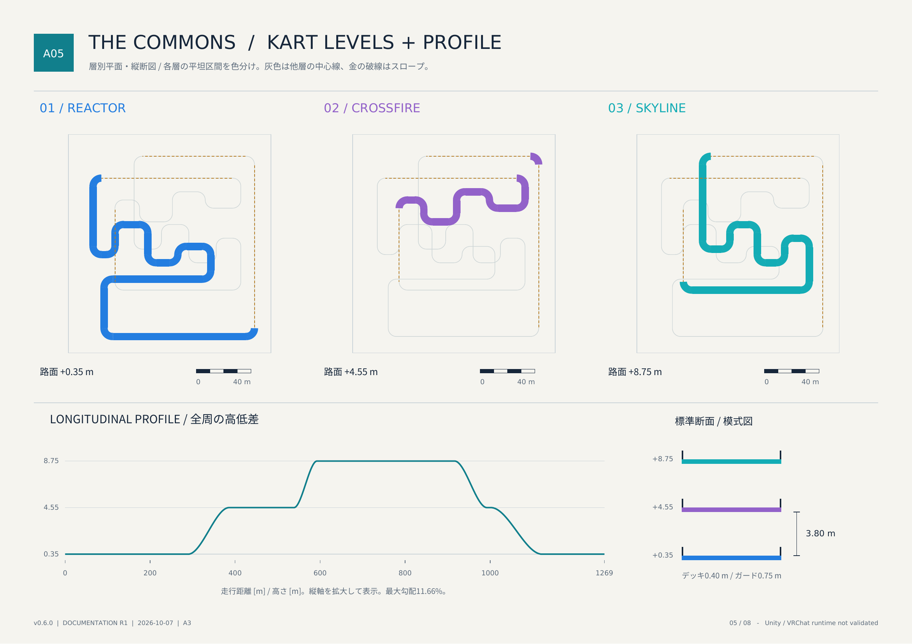
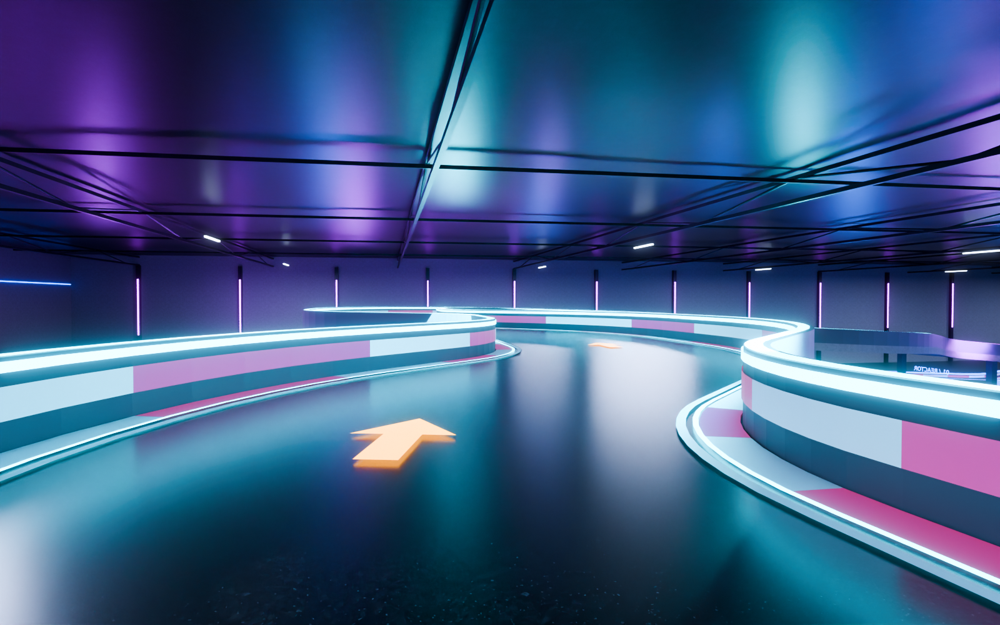

# The Commons — Compact Edition

**技術者カフェ・屋内FPV・屋内ネオンカートをワープで結ぶ、VRChatワールド制作データ。**

モデル版 **v0.6.0** ／ 詳細仕様・図面 **資料改訂1（2026-10-07）**。このREADMEは現在の生成ソース・マニフェスト・形状検査に基づきます。カフェで会話・発表・DJを楽しみ、独立したVECTORでドローン、APEXでカートを走らせる構成です。

**画像はBlenderの実モデルレンダーです。Unity／VRChatでの撮影ではありません。** カート全景のみ、レイアウトを見せるため屋根・手前2面の壁・トラスを非表示にしています。Unity/Udonコンパイル・ベイク・実機プレイは未検証。モデル・ソースからシーンを生成する配布物です。

[リリースと全ダウンロード](https://github.com/Xenoah/vrcworld_tech-tech-cafe/releases/tag/v0.6.0) · [A3図面集PDF](Documentation/Design/The_Commons_v0.6.0_Design_Atlas.pdf) · [Unity導入の詳細](README_JA.md) · [Unity MCP引き継ぎ](UNITY_MCP_HANDOFF.md)

## 1. 全体構成

| エリア | 外形・床面積 | 高さ | 主な用途 |
| --- | --- | --- | --- |
| THE COMMONS | 28 × 18 m、1F外形504 m² | 1F 0.00 m／2F +4.80 m、屋根下面9.60 m | バー・カフェ・学術発表・DJ・静かな会話 |
| VECTOR / Indoor FPV | 36 × 26 m、936 m² | 天井高8.00 m | VRC+ Camera Droneの練習・飛行・観戦 |
| APEX / NEON SWITCHYARD | 148 × 160 m、23,680 m² | 路面+0.35／+4.55／+8.75 m、壁高15.50 m | CVS2用の3層テクニカルカートコース |

カフェを中心にFPVとカートへ往復します。3エリアは離れた位置に置き、移動はInteract式ワープです。**生成シーンの定員設定は32人**。元設計資料の48／64人は計画値で、実機で成立を確認した人数ではありません。床面積は建築外形による値で、家具を除いた有効面積や2Fの床面積とは異なります。

### 座標とワープ

設計JSON／Blenderは `(X, Y, Z)`、Unityは `(X, Z, Y)` に変換します。以下はすべて **Unity `(X, Y高さ, Z)`、メートル** です。

| 項目 | 座標・範囲 |
| --- | --- |
| カフェ外形 | X 0〜28、Z 0〜18 |
| FPV外形 | X -64〜-28、Z 0〜26 |
| カート外形 | X 180〜328、Z 0〜160 |
| 初期スポーン | `(14, 0.10, 1.20)` |
| カフェ → FPVの着地点 | `(-42.50, 0.12, 2.00)` |
| FPV → カフェの着地点 | `(19.30, 0.12, 2.50)` |
| カフェ → カート観戦側の着地点 | `(226.294, 0.42, 35.00)` |
| カート → カフェの着地点 | `(23.80, 0.12, 4.10)` |
| カフェ上下階 | 入口側と西階段脇に往復ポータル |

## 2. カフェ・バー・発表空間

| 場所 | 現在の仕様 |
| --- | --- |
| ANCHOR / 西側バー | L字カウンター、11脚の装飾スツール、木リブ、真鍮足掛け、棚下灯、93本のボトルに6種類のラベル |
| 1Fカフェ | テーブル・6着席アンカー、エスプレッソ機、グラインダー、カップ、ソーサー、コーヒー袋 |
| 中央ラウンジ | 4クラスタ・12着席アンカー。Academicでは24席の観客配置へ切替 |
| 中央ステージ | 直径4.80 m、高さ0.25 m。幅1.50 mのアクセス斜面、演台、マイク、発表者マーク3か所 |
| 主画面／上階補助画面 | 7.10 × 4.00 m／5.68 × 3.20 m。同じスライドまたは動画を表示 |
| OPEN LAB / 東側ギャラリー | 差替可能なポスター6面、デモ展示台4台 |
| 1F Quiet Nook | 半開放の小休憩スペース、4着席アンカー |
| ORBIT / 2F西カフェ | テーブル・12着席アンカー。吹抜けに面した滞在場所 |
| RELAY / 吊り下げDJブース | 2デッキ・4chの装飾モデル、ジョグ・ノブ・フェーダー・パッド・印刷面。実ミキサー操作は未実装 |
| HORIZON / 2F東テラス | 外景を望む席、8着席アンカー |
| ARCHIVE / 2F Quiet Room | 本棚・印刷入りの本・4着席アンカー。BGMとプレイヤー音声をローカルに減衰 |
| AV / HOST | ホスト操作パネル、動画URL入力、機材ラック、保管スペース |
| 階段・上階回遊 | 東28段・36.44°、西25段・48.14°、各幅1.50 m。南北の橋で上階を接続 |
| 床・落下防止 | 上階床厚0.20 m。開放床端の手すり1.05 m、簡略化した衝突範囲1.30 m |

**着席アンカーはカフェ常設34、Lounge用12、Academic用24、FPV用7の計77。** 中央の12席と24席は切替なので同時には有効になりません。カートの観戦段・バーのスツールは形状のみで、着席アンカーを追加していません。着席は明示的なInteractで行います。

西階段は元CADの枠を維持した急勾配です。実機で登れない場合も脇のポータルで上下できます。図面の丸は着席アンカーの記号で、家具の輪郭ではありません。補完した上階接続・床開口・画面寸法は [CAD_CHANGES_JA.md](Documentation/CAD_CHANGES_JA.md) に記録しています。

## 3. VECTOR / 屋内FPV

| 項目 | 現在の仕様 |
| --- | --- |
| 飛行範囲 | ローカルX 1〜35、Z 6.2〜25 m。34 × 18.8 m＝639.2 m² |
| 操縦場所 | 南側X 2〜19、Z 1〜5 m。4着席アンカー |
| 観戦場所 | 南側X 23〜34、Z 1〜5 m。3着席アンカー |
| 人用動線 | 操縦／観戦を分けた配置、柵、境界を通る人用通路 |
| ゲート | 8基、開口3.20 × 3.00 m、フレーム厚0.18 m。開口を塞がない個別の衝突形状 |
| 誘導 | シアン・アンバー・ライムの区間色、番号、床の方向矢印 |
| 練習設備 | 中央の低い着地台、操縦・観戦側からの見通し |
| 外部機能 | VRC+ Camera Droneを利用。独自ドローン、操縦物理、レース計時は同梱なし |

ゲート中心は **フロア南西隅を原点としたローカル `(X, Z)`**。高さは床0 mからの値です。

| ゲート | 平面位置X／Z [m] | 進行方向 | 中心高 [m] | 開口下端〜上端 [m] | 色 |
| --- | --- | --- | ---: | --- | --- |
| 01 | 10／9 | +X | 1.90 | 0.40〜3.40 | シアン |
| 02 | 21／9 | +X | 2.30 | 0.80〜3.80 | シアン |
| 03 | 30／13 | +Z | 3.30 | 1.80〜4.80 | アンバー |
| 04 | 27／21 | -X | 3.50 | 2.00〜5.00 | アンバー |
| 05 | 20／22 | -X | 3.00 | 1.50〜4.50 | ライム |
| 06 | 11／21 | -X | 2.20 | 0.70〜3.70 | ライム |
| 07 | 6／18 | -Z | 2.10 | 0.60〜3.60 | シアン |
| 08 | 6／12 | -Z | 1.80 | 0.30〜3.30 | シアン |

ワールド／インスタンスのDrones許可を確認して利用します。半径0.16 mの仮想球で開口とゲート間の中心経路を検査済み。実ドローンの操縦感・フレーム時間・快適性はPC／Quest実機で確認してください。

## 4. APEX / NEON SWITCHYARD

写真の密度・青紫の光を参考に、**走路は独自設計**。低い壁と連続する切り返し、頭上の橋、閉じた屋内空間でテクニカルな走行感を狙っています。

| 項目 | 現在の仕様・検査値 |
| --- | --- |
| 全長／コーナー | 1,268.83 m／円弧コーナー34か所 |
| 走行幅／構造幅 | 5.20 m／デッキ6.50 m |
| 旋回半径 | 中心線の最小約6.00 m、走行幅内縁は約3.40 m |
| 低層 REACTOR | 路面+0.35 m、青のガイド |
| 中層 CROSSFIRE | 路面+4.55 m、紫のガイド |
| 上層 SKYLINE | 路面+8.75 m、シアンのガイド |
| 高低差の接続 | 4本のスロープ。接続端の勾配を滑らかに補間 |
| 最大勾配／橋下 | 11.66%／橋下面との最小クリアランス3.80 m |
| デッキ／ガード | デッキ厚0.40 m／ガード高0.75 m |
| 支柱／路面分割 | 路面を避けた支柱109本／中心線1,987点、間隔最大0.65 m |
| 建屋 | 全面屋根、外壁、鉄骨トラス。壁高15.50 m |
| ピット | 6台分の空のCVS2配置ガイド、番号・区画線、両端の歩行接続 |
| 観戦 | 3段の観戦席、約48 × 15 mの観戦デッキ、屋根、帰還ボタン、時間パネル |
| 路面・装飾 | 黒い光沢路面、ラバーガード、ピンク／白のパネル・縁石、タイヤ形状204個 |
| 光・誘導 | ガードの上端／側面LED、路面ガイド、紫の壁面灯、琥珀色の進行矢印、チェッカー |
| 照明の作成値 | レール補助103灯＋天井25灯＋ピット3灯。Unityではベイク用Point Lightとして生成 |
| 当たり判定 | 路面とガードは連続した静的MeshCollider。支柱等はBoxCollider。PC／Questで走行形状共通 |

### CVS2の導入範囲

CVS2本体・車両モデル・操縦・車両同期・レース管理は同梱していません。所有者が取得したCVS2を導入後、`KART_ExternalVehicleAnchors/CVS2_Bay_01`〜`06` の空Transformを目安に車両を配置します。車高・タイヤ・旋回・速度・衝突レイヤー・復帰設定は車両側で調整してください。

6ガイドのUnity高さは0.47 m、Zは45.60 m。Xは225.588／233.353／241.765／249.529／257.941／266.353 m、向きはY軸90°です。これは配置の目安で、車両のスポーンやリセット機能ではありません。詳細は [CVS2_INTEGRATION_JA.md](Documentation/CVS2_INTEGRATION_JA.md)。

| 低層の旋回 | ピット・観戦席 | 上層の旋回 |
| --- | --- | --- |
|  |  |  |

## 5. 共有操作・ローカル操作

### 活動モード

| モード | 中央配置 | 主な振る舞い |
| --- | --- | --- |
| Lounge（初期） | 4クラスタ・12着席ポイント | 会話用BGMと通常表示 |
| Academic | 24席 | 発表操作、ホログラム非表示、BGM低下 |
| DJ / Live | 中央家具を非表示 | DJ音源・ビジュアル、または同期動画 |
| Quiet Night | Lounge配置 | 発光量とBGMを抑制 |

共有操作は初期設定でインスタンス所有者またはMasterに限定。変更時に所有権を取得して同期します。権限は `hostLocked` で設定。活動モードと時間帯は別の状態です。

| 機能 | 操作・実装 |
| --- | --- |
| 発表 | スライド4枚の前後切替、15分トーク、5分Q&A、停止、Q&A表示、終了 |
| タイマー | サーバー時刻基準で共有。終了時にLoungeへ戻る |
| 画面ポインター | 表示切替と上下左右ボタン。画面幅・高さの5%刻み。視線追従や手追従ではない |
| 動画 | VRCUnityVideoPlayer、URL入力とLOAD／STOP。主画面と上階画面で同一RenderTextureを使用 |
| 動画同期 | URL・再生状態・開始時刻を共有。5秒ごとに確認し、1.5秒を超える時刻差を補正。長さ未確定のライブはシークしない |
| 動画解像度設定 | PC 最大1080／Quest 最大720。実際のURL対応・配信側仕様は未検証 |
| 着席 | Interact式。通り過ぎるだけでは着席しない |
| ローカル快適設定 | REDUCED MOTION（初期ON）、LOW EMISSION、DJ VISUALS、SOFT GLOW |
| ローカル鏡 | PCのみ、初期OFF。SDKの鏡シェーダーが見つからない場合は作成を省略 |
| 話題カード | 4つの短い問いをローカルで切替 |

### 音と時間帯

- オリジナルの環境音・アンビエント・96 BPMのDJループを収録。動画再生中はBGM／DJ音源を抑制します。
- Quiet Room内ではBGMと動画音声を減衰。別の部屋／エリアにいるプレイヤー音声は、初期設定でGain 5・Far 8 m、同じ側はGain 15・Far 18 mへ調整します。防音やプライバシーを保証する仕組みではありません。
- カフェ・FPV・カート観戦側に時間パネル。DAWN 6時／DAY 12時／DUSK 18時／NIGHT 0時、±1時間、CYCLE／HOLDを操作。初期時刻20時、連続サイクルは24分で1日です。
- 空・太陽・霧・環境色・素材の補助光を連続補間し、時刻と起点を共有します。ライトマップと反射は静的1組です。
- カート室内のマテリアルは固定の青紫色・発光。室内滞在中の霧と環境色も固定し、外の時間帯で雰囲気を変えません。LOW EMISSION等のローカル設定は有効です。

| 朝 | 昼 | 夕 | 夜 |
| --- | --- | --- | --- |
|  |  |  |  |

## 6. 描画・素材・PC／Quest

| 項目 | PC | Quest |
| --- | --- | --- |
| 建築・家具 | PBR、金属度・粗さ、弱い微細法線 | 軽量な明暗とハイライト、ベイク光 |
| 窓ガラス | Fresnelとベイク反射 | 窓の描画を省略、衝突は保持 |
| グロー | 器具のグローカード＋任意の弱いBloom | グローカード。Post Processingなし |
| 反射プローブ | カフェ・FPV・カートに各1、128 px、Box Projection、ベイク | 作成しない |
| 太陽 | Realtime Directional Light 1灯 | シェーダー側の補助色・方向 |
| ライトマップの生成設定 | 20 texels/m、最大2048 | 12 texels/m、最大1024 |
| 共通の照明 | ベイクGI有効、Realtime GI無効、Progressive CPU。直接32／間接64／環境64サンプル | 同左 |
| 建築素材の取込上限 | 1024 | 512 |
| 描画距離 | Reference Camera far clip 900 m、near 0.03 m | 同左 |

BloomはPost Processing導入時に生成します。強度0.16、閾値1.15、Soft Knee 0.55、Diffusion 4、Fast Mode。未導入なら器具グローのみ。カートの広い床・屋根・外壁にはライトマップ密度の倍率0.08、他のカート部材には0.4を設定しています。

建築テクスチャ6種は木・左官・テラゾー・黒皮鋼・真鍮・織布。DJ・酒ラベル・小物用アトラス3種を加え、原本は計9画像です。建築素材はMirror、印刷用アトラスはClamp。元画像の左右・上下端がRepeatで完全一致するとは保証していません。

エリア移動時は遠い側の建築Rendererをローカルで非表示にします。コライダーとUdonは維持し、各エリアのアセットはメモリに残ります。外部CVS2車両をこの建築Renderer配列に登録しないでください。AudioLinkは任意の外部導入で、DJシェーダーは4バンドを参照します。

### 書き出し形状の実測

| 対象 | PC三角形数 | PCメッシュ数 | Quest三角形数 | Questメッシュ数 |
| --- | ---: | ---: | ---: | ---: |
| ワールド全体 | 295,797 | 186 | 245,507 | 176 |
| うちFPV | 19,944 | 22 | 14,331 | 21 |
| うちカート | 135,913 | 35 | 123,403 | 35 |

メッシュ数は書き出し単位で、Unityの描画回数やSetPass数ではありません。PC／Quest実機のFPS・メモリ・配信サイズは未測定です。

## 7. 平面図・デザイン画

**[A3横・8ページの図面集PDF](Documentation/Design/The_Commons_v0.6.0_Design_Atlas.pdf)** ／ **[追加資料一式ZIP](https://github.com/Xenoah/vrcworld_tech-tech-cafe/releases/download/v0.6.0/The_Commons_v0.6.0_Docs_r1.zip)**

| シート | 内容 | PNG | SVG |
| --- | --- | --- | --- |
| A01 | 3エリアの配置・ワープ・座標 | [配置図](Preview/Design/01_World_Layout.png) | [ベクター](CAD/Plans/01_World_Layout.svg) |
| A02 | カフェ1F・2F、床開口、階段、着席位置 | [平面図](Preview/Design/02_Cafe_Floor_Plans.png) | [ベクター](CAD/Plans/02_Cafe_Floor_Plans.svg) |
| A03 | FPV領域・8ゲート・高さ・席 | [平面図](Preview/Design/03_FPV_Floor_Plan.png) | [ベクター](CAD/Plans/03_FPV_Floor_Plan.svg) |
| A04 | カート全周・高さ別の色分け・ピット | [総合平面図](Preview/Design/04_Kart_Overall_Plan.png) | [ベクター](CAD/Plans/04_Kart_Overall_Plan.svg) |
| A05 | カート各層・縦断図・標準断面 | [層別図](Preview/Design/05_Kart_Levels_Profile.png) | [ベクター](CAD/Plans/05_Kart_Levels_Profile.svg) |
| D01 | カフェの空間・機材・素材 | [デザイン画](Preview/Design/06_Cafe_Design.png) | — |
| D02 | FPVの視認性・区間色・観戦 | [デザイン画](Preview/Design/07_FPV_Design.png) | — |
| D03 | カートのネオン・橋下・上層 | [デザイン画](Preview/Design/08_Kart_Design.png) | — |

編集用DXF: [カフェ1F・2F](CAD/The_Commons_Cafe_Floors_v06.dxf) ／ [FPV](CAD/VECTOR_FPV_Plan_v06.dxf) ／ [カート](CAD/APEX_Kart_Neon_Switchyard_v06.dxf)。DXF単位はmm。カフェDXFの2Fは並列表記のためX方向に38,000 mmずらしています。FPV DXFはフロアローカル、カートDXFはBlenderのワールド平面座標です。

平面図は現行の床・壁・衝突形状・着席アンカー・中心線データから作成した実装説明図です。装飾・小物は省略。カートの縦断図は高さを拡大し、断面は寸法関係の模式図です。デザイン画は**実モデル画像を編集配置した資料**で、追加の建築案や生成AIの想像図ではありません。色見本はデザイン意図の概略です。

## 8. 導入・配布・編集

1. VCCでWorlds / Built-in Render Pipelineのプロジェクトを作成。制作時の基準は **Unity 2022.3.22f1／VRChat SDK 3.10.5**。現在の対応版はVCC・公式の指定に従ってください。
2. [v0.6.0のUnityパッケージ](https://github.com/Xenoah/vrcworld_tech-tech-cafe/releases/tag/v0.6.0)をインポートするか、`Unity/Assets/TheCommons` と `.meta` をコピー。SDK・UdonSharpはVCC側で導入します。
3. PCのBloomを使う場合は `com.unity.postprocessing@3.4.0` を導入。**The Commons → Build PC World** または **Build Quest World** を実行します。
4. シーンは `Assets/TheCommons/Generated/PC_日時/` または `Quest_日時/` に新規作成。CVS2／AudioLinkを使う場合は所有者側で追加します。
5. **The Commons → Bake lighting**、VRChat SDKのBuild & Test、PC／Quest・複数人での確認を行います。アップロードやBlueprint IDは所有者が管理します。

| 配布物 | 用途 |
| --- | --- |
| `The_Commons_Compact_v0.6.0.unitypackage` | Unityへインポートするモデル・素材・Editor・UdonSharp・シェーダー |
| `The_Commons_Compact_v0.6.0_Full.zip` | v0.6.0公開時点の制作データ。Blender・CAD・設計・再生成ソース・実モデル画像19枚 |
| `The_Commons_v0.6.0_Design_Atlas.pdf` | 今回追加したA3図面集8ページ |
| `The_Commons_v0.6.0_Docs_r1.zip` | 今回の詳細README・リリース本文・図面・デザイン画・既存画像・設計根拠 |
| `SHA256SUMS-v0.6.0.txt` | 公開済みモデル配布物・画像のチェックサム |
| `SHA256SUMS-v0.6.0-docs-r1.txt` | 今回の追加資料・画像のチェックサム |

今回の資料改訂ではモデル・Unityソース・既存配布パッケージ・v0.6.0タグは変更していません。最新資料はmainと追加資料ZIPに収録しています。

`.blend` は圧縮保存し、画像とフォントをリポジトリ内の相対パスで参照します。Blender編集時はFull.zipを全体展開するかリポジトリごと取得してください。プレビューモデルは [glTF](Preview/The_Commons_Compact.gltf) と [.bin](Preview/The_Commons_Compact.bin)。ブラウザ歩行ビューアは別プロジェクトです。

再生成手順・素材差替は [README_JA.md](README_JA.md)。図面集の作成は `Blender/build_design_atlas.py`。Pythonのreportlab／Pillow／numpy／fonttools／ezdxfとPoppler、Noto Sans CJK JPのOTFが必要です。`COMMONS_JAPANESE_FONT` でフォントパスを指定できます。PDFには日本語フォントを部分埋め込みしています。

## 9. 検証状況と正本

| 区分 | 現在地 |
| --- | --- |
| 実施済み | 共通形状36項目＋カート15項目、PC／Questメッシュデータ、C#構文12ファイル、メタデータ、モデル配布物の内容一致、実モデル画像の確認 |
| 今回の資料 | 8ページをレンダリングして目視確認。寸法は現行マニフェスト、層別図と縦断図は同じ1,987点の走路から生成 |
| 未実施 | Unity/Udon・シェーダーのコンパイル、Unityライトベイク、VRChat Build & Test、CVS2実走・同期、VRC+実飛行、VR両眼、Quest実機性能 |

[共通形状検査](Documentation/validation_report.json) · [カート形状検査](Documentation/kart_validation.json) · [モデル計測](Documentation/geometry_report.json) · [Unity実機受入表](Documentation/ACCEPTANCE_JA.md) · [図面の入力・版情報](Documentation/Design/atlas_manifest.json)

元の `SourceDesign/world_spec.json` には初期コンセプトの人数・機能案も残しています。現行形状は `Documentation/model_manifest.json`、Unity用変換は `Unity/Assets/TheCommons/Data/world_manifest.json`、生成機能はC#ソース、FPV／カートの配置は各設計JSONと検査報告を参照してください。

SDK・UdonSharp・AudioLink・CVS2・車両本体は同梱していません。フォントの権利表記は [DejaVu](Documentation/DejaVu_Font_License.txt) と [Noto](Documentation/Noto_Font_License.txt)。画像の生成・素材履歴は [texture_provenance.json](Documentation/texture_provenance.json)。
